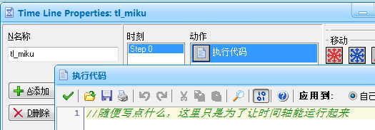
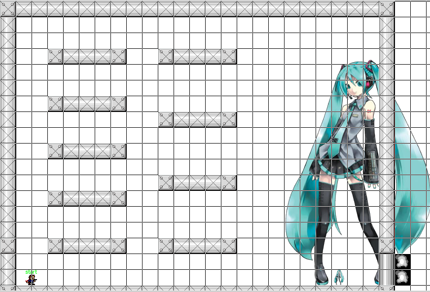
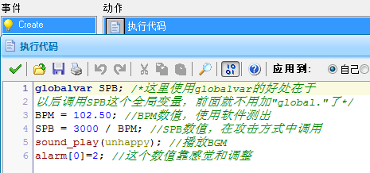
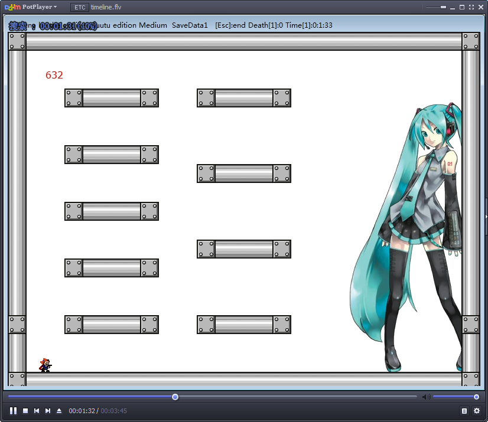
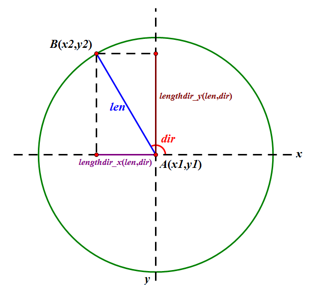

# 耐久超基础教程

?> :chicken::chicken::chicken::chicken::chicken::chicken::chicken:

## 前期准备

为了制作一个耐久你需要准备的材料有：

* 一份 GMK(这里使用的是 yuuutu v2.01 引擎)
* 一首合适的 BGM
* BPM 测试软件
* 视频录制软件（`OBS`/`Bandicam`/`Camtasia Studio` 还是其他的随你，只要能录视频就行，这里使用的是 OBS）


先来简单的讲解一下 BPM 测试软件的用处：
BPM 即 Beats Per Minute，表示歌曲在每分钟内的节拍数。这个数值可以帮助我们更好地来写时间轴事件。在 I Wanna 游戏中，1 秒被分割成为 50 步，1 分钟就有 50 \* 60 = 3000 步。而在这一分钟内，歌曲一共出现了 BPM 个节拍，在一个节拍内通常有 4 个鼓点，如果我们将时间轴的速度放慢，使得每 4 步中歌曲播放一拍，将使我们的时间轴得到极大的简化。也就是：

```gml
timeline_speed = BPM * 4 / 3000
```

在这样设置后，时间轴上的每 4 步就对应歌曲的一拍。值得说明的是，4 这个数值并不是固定的。如果某些歌曲一小节只有 3 拍的话这个数值可以取 3，而对于那些快节奏的歌，4 这个间隔有时候会显得太小（例如在 beat=4 时，我需要在 1.5 步和 2.5 步插入一个事件，这样做是办不到的因为时间轴上没有小数步，而取 beat = 8，就可以在 3 步和 5 步上插入一个事件）。

在这里还可以引入一个新变量：SPB，也就是 Steps Per Beat，每个节拍所对应的步数。计算公式为：SPB = 3000 / BPM。这个数值对我们制作攻击方式有着巨大的作用。

打开 BPM 测试软件，把 BGM 直接扔进去就可以得到 BPM 数值：102.50


下面打开 GMK，我们首先添加一个时间轴 tl_miku，并在 step0 上插入一个事件，在里面写点东西让时间轴能跑起来。



下面就轮到 boss 的 obj 了。直接上图好了，反正有中文注释。


在 step 事件中，需要加一个防止剧透的功能。


在 draw 事件中，监控当前的时间轴位置。这里使用了 4\*(a div 4)这种算式，可以将{0,1,2,3,4,5,6,7,8,9}这种数列转换为{0,0,0,0,4,4,4,4,8,8}，以免数字跳动太快肉眼跟不上。


接下来把 mikumiku 放入 roommiku 的原位置(639,355)，并删去其他的无关 obj。



在 bossitem1 的 step 事件中，将 objmiku 改为 mikumiku。在 warpStart 中，将 rStage01 改为 roommiku。运行游戏。

在游戏中仔细观察左上角红色数字的跳动与 BGM 的拍子之间的快慢关系。如这首歌中，我感到数字跳动总是比音乐节拍要快那么一点，所以在 create 中将时间轴有关的代码移至 Alarm 0 事件，并在 create 中给 alarm[0]一个值。



Alarm 0 事件中：


这样运行之后数字跳动和节拍达到了同步。我们打开视频录制软件，将这首 BGM 以及左上角的数字录制下来，就可以知道歌词歌曲与时间轴步数的对应关系。



## 弹幕基础知识

在开始制作弹幕之前，你需要知道的 GM 内置变量/函数有：

* x：obj 的 x 坐标
* y：obj 的 y 坐标
* hspeed：obj 运动的横向速度
* vspeed：obj 运动的纵向速度
* speed：obj 运动的速度
* direction：obj 运动的方向（向右为 0，向上为 90）
* friction：obj 的运动阻力（设置为负数可以达到加速效果）
* gravity：obj 的重力
* gravity_direction - obj 的重力方向（默认向下）
* point_direction(x1, y1, x2, y2)：返回点(x1, y1)到点(x2, y2)的方向。例如：point_direction(400, 304, 400, 404) = 90 ; point_direction(x, y, player.x, player.y) 即可瞄准 player。
* point_distance(x1, y1, x2, y2)：返回点(x1, y1)到点(x2, y2)的距离。
* lengthdir_x(len, dir)：返回长度为 len，方向为 dir 的矢量在 x 轴上的投影长度
* lengthdir_y(len, dir)：返回长度为 len，方向为 dir 的矢量在 y 轴上的投影长度这两个函数理解起来可能有些困难，参考下图：



值得注意的是 lengthdir_x/lengthdir_y 返回的并不仅仅是距离，而是有正负之分的。

在本图中，B 点在 A 点的左侧，`lengthdir_x(len, dir)` 即为负值，所以在算式中需写为 `x2 = x1 + lengthdir_x(len, dir)`，这样 x2 才会比 x1 的数值要小。图中 B(x2, y2) 在 A(x1, y1) 的 dir 方向处，即 `dir = point_direction(x1, y1, x2, y2)` ; AB 之间的距离为 len，即 `len = point_distance(x1, y1, x2, y2)`。那么在已知 A 点坐标和 len, dir 的情况下，B 点坐标就可以表示为：B(x1 + lengthdir_x(len, dir) , y1 + lengthdir_y(len, dir))。如果在每步都改变 dir 值，B 点就会绕着 A 点以 len 为圆心转动。这种思路在设置 obj 旋转时是必不可少的。

至于攻击方式的制作，可以移步 nikaple 吧的置顶，这份教程能教你的到此为止啦(´・ω・｀)

这份教程是很早以前写的！

?> :chicken::chicken::chicken::chicken::chicken::chicken::chicken:
