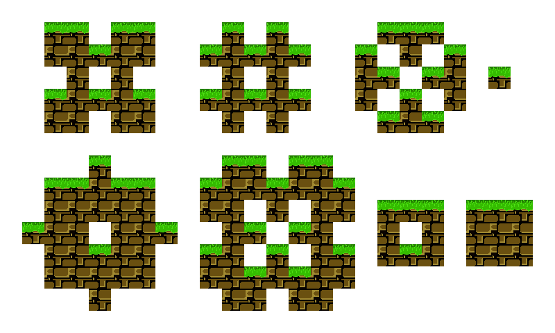
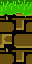
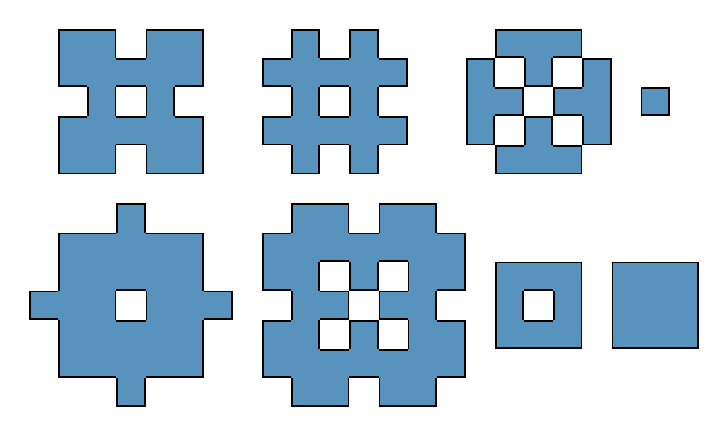
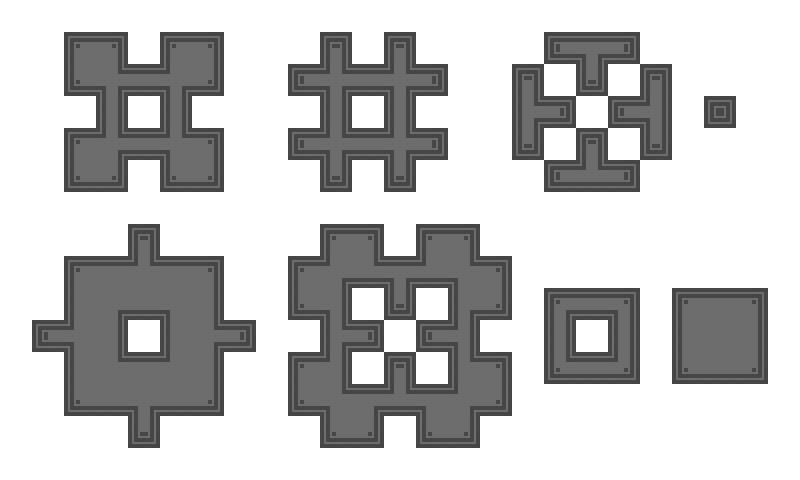
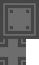
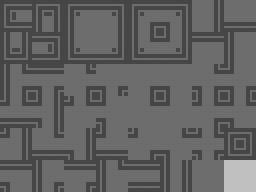
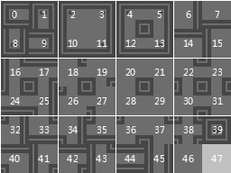
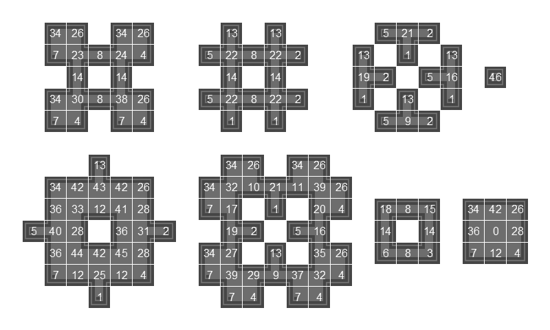

# Automatic mapping

!> This page is translated by Google Translate, Click **Edit Document** on the top left corner if you want to help the project out!

## Instructions

Auto-mapping is a great tool for improving the efficiency of game production. It allows you to do a unified processing of all the room's auto-maps in the script `autoBlockTile`. The default depth of the automap is 2000000, which allows you to easily override and modify the dissatisfaction (for traps). The engine currently supports three automatic map modes:

- Two directions (vertical)
- Four directions
- Eight directions

You can add auto-mapped code like this in the script `autoBlockTile`:

```gml
case rTraps:
    // Use vertical maps
    autotile(2, bgGrass)
    break
case rOnlineWarpSync:
    // Use four-way textures, each with a 32-pixel size
    autotile(4, bgMetal, 32)
    break
case rOnlineTriggerAndButton:
    // Use four-way textures, each with a size of 16 pixels
    autotile(4, bgLine)
    break
case rOnlineSpike:
    // Use 8-way textures with 32 pixels per texture
    autotile(8, bgIsland, 32)
    break
case rOnlineBossSample:
    // Use 8-way textures, each with a size of 16 pixels
    autotile(8, bgVVVVVV)
    break
```

The `autotile` script can take 6 parameters:

- Direction type of map (required)
- Use the name of the map (required)
- Use map mode (optional, 32 \* 32 requires 32,16 \* 16 can be omitted)
- Depth of texture (optional, default 2000000)
- Spacing between each texture in the provided background image (optional, default 0)
- Number of textures per line in the provided background image (optional, valid only in 32\*32 pixel mode for four/eighth maps, defaults to 4 (four-way) / 8 (eight-way))

## Vertical

Preview:


Before using vertical textures you need to prepare one of the following textures:



- The size is 32 \* 64 pixels;
- The top part is the top map and the bottom part is the other maps.

?> The map at the top of the room is displayed with the bottom map.

Code:

```gml
autotile(2, bg)
```

## four-way mapping

Preview:


!> When using four-way mapping, the edges of the texture should be as small as possible because the four-way texture will not do any processing on the interior corners.

Supports two modes:

- 16 \* 16
- 32 \* 32

### Use 16 \* 16 tilesets

Using 16 \* 16 tilesets means that each brick (32 \* 32) texture consists of 4 16\*16 textures. You only need to prepare one of the following textures:


- The size is 48 \* 48 pixels;
- The surrounding 8 tiles are bordered and the middle is an internal texture.

?> If you want to use this method, it is highly recommended to use [eight-map](autotile?id=8-map)

Code:

```gml
autotile(4, bg)
```

### Using 32 \* 32 tilesets

Using 32 \* 32 tilesets means that you have more fine-grained control over each texture, making the game look richer. You need to prepare one of the following maps:


Can't see? Look at the picture below


This way you can make random decorations for textures in different locations to make the map look more natural.

Code:

```gml
autotile(4, bg, 32)
```

## Eight-way maps

Preview:


Supports two modes:

- 16 \* 16
- 32 \* 32

### Use 16 \* 16 tilesets

Using 16 \* 16 tilesets means that each brick (32 \* 32) texture consists of 4 16\*16 textures. You only need to prepare one of the following textures:



- The size is 48 \* 80 pixels;
- The above 48 \* 48 sections are the same as the four-way maps (around 8 blocks are border maps, and the middle is inner maps.), and the bottom 32 \* 32 sections are four inner corner maps.

Code:

```gml
autotile(8, bg)
```

### Using 32 \* 32 tilesets

Using 32 \* 32 tilesets means that you have more fine-grained control over each texture, making the game look richer. You need to prepare one of the following maps:



!> The top left corner of the texture is the 0th texture! The number of textures per line and the spacing between textures can be set, but the order must be the same!

Can't see? Look at the picture below




This way you can make random decorations for textures in different locations to make the map look more natural.

Code:

```gml
autotile(8, bg, 32)
```
