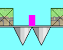
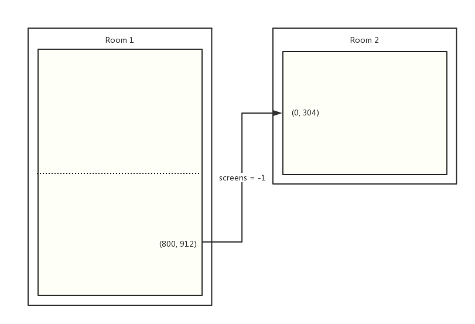

# Object Document

!> This page is translated by Google Translate, Click **Edit Document** on the top left corner if you want to help the project out!

!> Errata, please click **Edit Document** in the upper left corner. Thanks!

### Blocks Bricks

#### objBlock Plain brick

Ordinary bricks placed in the room can make `player` walk on it.

!> Be sure to use `objBlock` instead of `block` in the `parent` folder, which will make `player` unable to walk.

#### blockBullet Block Bullet Brick

Block bullets for bricks. Save protection.

#### blockMove bricks

Bricks that move after encountering `player`.

Creation Code Parameter:

```gml
spr = sprBlock // Optional, sprite
  h = 4 // Optional, lateral speed
  v = 2 // Optional, vertical speed
spd = 3 // Optional, speed
dir = 0 // Optional, direction
```

#### blockInvisible Hide Brick

It will only be displayed after encountering `player`.

Creation Code Parameter:

```gml
spr = sprBlock // Optional, sprite
snd = sndBlockChange // Optional, sound effects
```

#### blockFake fake brick

It will disappear after encountering `player`.

Creation Code Parameter:

```gml
spr = sprBlock // Optional, sprite
snd = sndBlockChange // Optional, sound effects
```

#### blockPush can push bricks

The brick that can be pushed can move with the conveyor and the board.

!> There are still bugs in the 1.8 version

Creation Code Parameter:

```gml
frc = 1 // Optional, friction, defaults to 1
wrap = false // Optional. If it is set to true, it will appear from the other end when it falls out of the room vertically. The default value is false.
grav = 0.4 // optional, gravity, default 0.4
maxvspeed = 10 // Optional, maximum drop speed, defaults to 10
```

#### BlockConveyorL Left Conveyor Belt

Creation Code Parameter:

```gml
spr = sprBlock // Optional, sprite
h = -2 // Optional, conveyor speed, defaults to -2
```

#### BlockConveyorR Right Conveyor Belt

Creation Code Parameter:

```gml
spr = sprBlock // Optional, sprite
h = 2 // Optional, conveyor speed, defaults to 2
```

#### miniBlock Small Brick

There is no difference with ordinary bricks, it is a small point.

### Killers Obstacles

#### deliciousFruit

Delicious fruit.

In addition to the [Default Creation Code](cc.md), additional Creation Code parameters are supported:

```gml
bounce = true // Does the wall bounce?
wrap = true // If true, the screen will appear from the other end
```

#### spikeDown, spikeLeft, spikeUp, spikeRight

#### miniSpikeDown, miniSpikeLeft, miniSpikeUp, miniSpikeRight

Ordinary obstacles. Among them, eight kinds of four-pointed sprites can be automatically replaced according to the room in the script `autoSpikeSprite` with reference to [auto sprite's wizard](autosprite.md).

?> Now you can directly change these stinging elvens without failing. Of course, it is highly recommended that you use the autoSpikeSprite script for automatic configuration.

?> Any thorn in the engine can be used as a trigger thorn! For details, please see [New Trigger System](trigger.md)

#### borderKiller

Use player to kill `player` when it falls off the screen. Used to simulate a normal room death in a large room.

1.  Use a normal thorn to die when the player hits the thorn.



2.  Use `borderKiller` to die when the player is out of sight.


### Triggers Triggers

#### objTrigger

trigger. Please refer to [New Trigger System](trigger.md)

`Creation Code` parameters:

```gml
trg = 1 // Required, trigger number
snd = sndCherry // Optional, sound when triggered
xs = 2 // Optional, horizontal zoom
ys = 2 // Optional, vertical scaling
```

#### objSequenceTrigger

Timing triggers. The default can trigger 20 times. Please refer to [New Trigger System](trigger.md)

```gml
// i >= 1 in the following code
Trg[i] = 1 // Required, the i th trigger number
Time[i] = 50 // Required, trigger from number i to number i + 1 Trigger time
Snd[i] = sndBlockChange // Optional, touch sound effect of the i th trigger
xs = 2 // Optional, horizontal zoom
ys = 2 // Optional, vertical scaling
```

#### objButton

Button trigger. When `player` fires this button, the corresponding mechanism will be triggered. (The `key` parameter is not supported)
`Creation Code` parameters:

```gml
trg = 1 // Required, trigger number
spr = sprGreenButtonLeft // Optional, sprite
```

#### trgMultiplePath

Multiple paths stab. Can be triggered by multiple triggers in sequence.

`Creation Code` parameters:

```gml
// i >= 1 in the following code
spr = sprSpikeUp // required, the wizard used
Trg[i] = 1 // Required, the i th trigger number
Pth[i] = pU1 // is required, the name of the i th path
Spd[i] = 6 // Required, the speed in the i th path
Enda[i] = PATH_ACTION_END // Optional, path end event for the i th path
Scl[i] = 2 // Optional, path scaling of the i th path
```

The possible values ​​for [path end event] (constant?id = path end action) can be found in the constants table

#### trgPathBlock

Path bricks. After triggering, it will move according to the specified path.

?> If player touches pathFreeBlock on the move, it will be judged dead.

Creation Code Parameter:

```gml
spr = sprBlock // Required, use the sprite
trg = 1 // Required, trigger number
pth = pD1 // Required, path name
spd = 7 // Required, movement speed
enda = PATH_ACTION_STOP // Optional, path end event
scl = 1 // Optional, path scaling
move = true // Optional, whether to prevent spoilers (the player will move in the current direction after death, not stop/turn)
```

#### trgBlockFake

Triggered false bricks. It is not different from bricks when it is not triggered, but it will become false bricks after triggering.

Creation Code Parameter:

```gml
trg = 1 // Required, trigger number
spr = sprBlock // Optional, using sprites
```

#### trgBlockInvisible

Trigger type invisible brick. It is no different from the air when it is not triggered, but it becomes an invisible brick after triggering.

Creation Code Parameter:

```gml
trg = 1 // Required, trigger number
spr = sprBlock // Optional, using sprites
```

### Gimmicks

This folder contains obj, which inverts gravity, water, vines, boards, etc.

#### objGravUp

Reverse gravity. The view will rotate with it.

#### objGravDown

Return to normal gravity. The perspective will be restored.

#### objWater

Normal water. The jump height is two jump heights, and the water has two sections.

Creation Code:

```gml
spd = 2 // max fall speed in water
```

#### objWaterNo2ndJump

Second paragraph water. The jump height is two jump heights, and there is no water in the second section.

Creation Code:

```gml
spd = 2 // max fall speed in water
```

#### objWaterNoJump

No diving. Only the speed will be reduced without recovering the number of jumps.

Creation Code:

```gml
spd = 2 // max fall speed in water
```

#### objInfiniteJump

After hitting the player, it allows him to jump infinitely.

#### objInfiniteJumpDisable

After hitting the player, it cannot be jumped infinitely.

#### objWalljumpR, objWallJumpL

vine

#### objMovingPlatform

Ordinary wood board.

`Creation Code` parameters:

```gml
// Direct assignment will directly move
hspeed = 3 // horizontal speed
vspeed = 3 // vertical speed
// Use h, v, wait for the player to stand and move again
h = 3 // Lateral speed after touch
v = 3 // vertical speed after touch
```

#### objPathPlatform

Wooden planks moving along the path.

`Creation Code` parameters:

```gml
// Move along pth directly at spd speed.
path_start(pth, spd, enda, 0);
// After the player has boarded the board, he starts to move again
pth = pD1 // Required, path name
spd = 7 // Required, movement speed
```

Other optional parameters:

```gml
enda = PATH_ACTION_STOP // End of path event
scl = 1 // path zoom factor
move = false // Whether to prevent spoilers (the player will move in the current direction after death, not stop/turn)
draw = false // Whether to draw the path
color = c_black // draw the color of the path
width = 1 // draw the width of the path
```

#### objRoundingCherry

Generate an apple circle. The obj needs to be placed at the center of the apple circle.

Creation Code Parameter:

```gml
num = 15 // Required, total number of apples
rad = 100 // Required, apple circle radius
spd = 0.72 // Required, circle speed
ang = 0 // optional, initial angle (0~360)
spr = sprCherry // optional, apple sprite (default is normal red apple)
```

- Changing `ang` can change the position of each apple in the apple circle
- The unit of spd is degree/frame. If you need to rotate 360 ​​degrees within 10 seconds, spd = 360/(10\*50) = 0.72

#### objPathSpike

Generate a series of evenly distributed motion punctures following a path. The obj needs to be placed at the start of the path.

Creation Code Parameter:

```gml
num = 5 // total number of spurs (the default is 1, if you use this obj to make a telescopic thorn, you can omit this parameter)
pth = p9_1 // motion path
off = 0 // Initial position (change this value can change the refresh position of each thorn in the path, 0~1)
spd = 2 // The speed at which the thorns move along the path
spr = sprSpikeUp // Spiked sprite (optional, by default, normal sting up)
```

#### objJumpRefresher

+1 jump.

Creation Code Parameter:

```gml
time = 50 // refresh time
```

### Host Host Dedicated

The object in this folder only applies to the owner.

| Object name     | use            |
| --------------- | -------------- |
| blockHost       | brick          |
| spikeDownHost   | Thorn          |
| spikeLeftHost   | Thorn          |
| spikeUpHost     | Thorn          |
| spikeRightHost  | Thorn          |
| warpHost        | transfer point |
| playerStartHost | Birth Point    |
| freeButtonHost  | Button         |

### Guest is not for host

The object in this folder only applies to non-homeowners

| Object name      | use            |
| ---------------- | -------------- |
| blockGuest       | brick          |
| spikeDownGuest   | Thorn          |
| spikeLeftGuest   | Thorn          |
| spikeUpGuest     | Thorn          |
| spikeRightGuest  | Thorn          |
| warpGuest        | transfer point |
| playerStartGuest | Birth Point    |
| freeButtonGuest  | Button         |

### Saves Archive Points

There are 4 statuses for archive points in the engine:

- Red: default
- Yellow: Indicates that this archive point requires all players to fire together to take effect.
- Blue: Indicates that other players have been archived (but nothing to do with you)
- Green: Successfully archived

#### savePoint

Ordinary single archive point, there are `Red`, `Blue`, `Green' three states.

#### savePointWait

Wait for the archive. Shooting can be successful for all people. The position of the last person is the location of the archive. There are three states `red`, `yellow`, and `green`.

#### savePointSync

Synchronous archiving. After an individual is archived, everyone else can transfer it to the archive by resetting the game. There are two states `red` and `green`.

### Warps

In Nikaple Engine version 2.0, the warpX/warpY parameter was removed and replaced by the **numbered `playerStart` **. That is, you can specify a number `num` in the warp. When the player enters the transmission point, it will be sent to the `playerStart` position numbered `num` in the corresponding room.

#### warp

Normal warp.

Creation Code Parameter:

```gml
roomTo = rTraps // Required, the name of the room sent to. If it is in the room, fill in -1.
num = 0 // optional, number passed to playerStart
kind = 0 // Optional, room transition effect used
clearSpeed ​​= false // Optional, whether to clear the player's speed
screens = 1 // Optional, panning the number of rooms
text = "text" // Optional, draw text
color = c_red // Optional, text color
```

A description of the `screens` parameter:



As shown in the figure, suppose you want to transfer from (800, 912) in room1 to (0, 304) in room2, not only to set the x coordinate to 0, but also to shift the y coordinate up one screen distance. (608 pixels). This will allow the ordinate of the `player` to appear unchanged on the screen, enhancing game continuity.

In this case, set `screens` to -1.

?> For room transition effects, refer to [Transition Effect](transition.md)

#### warpSync

After transmission, other players will be sent (including death).

#### warpWait

The transfer point where all players will enter into effect.

#### warpWaitingBG

The waiting screen displayed after the player enters warpWait.

#### borderWarp

#### borderWarpSync

#### borderWarpWait

Invisible warp. If we put `warp` outside the room, we often need to stretch it. Due to the irregular shape of the `warp`, stretching can cause the transfer to fail at certain angles. Therefore, use `borderWarp*` when the room edge needs to be transferred to another room.

Creation Code Parameter:

```gml
roomTo = rTraps // Required, the name of the room sent to.
kind = 0 // Optional, room transition effect used
width = 1 // Optional, the ratio of the width of the target room to the width of the field of view. Normally room_width / 800 can be used instead
height = 1 // Optional, the ratio of the height of the target room to the height of the field of view, which can usually be replaced with room_height/800
screens = 1 // Optional, panning the number of rooms
```

For the screens parameter, refer to [here](objectref?id=warp)

#### warpStart

Warp for selecting the interface.

Creation Code:

- dif for game difficulty (-1 – Load, 0 – Medium, 1 – Hard, 2 – Very Hard, 3 - Impossible)
- text represents text that needs to be drawn above the warp.

#### bossWarp

Get the `warp` that only appears for a particular `bossItem`, `Creation Code` refers to the normal `warp`, which is not visible by default. Therefore, we need to write in the destroy event of the same room boss:

```gml
bossWarp.visible = true
```

#### bossWarpSync

Get the `warpSync` that only appears for a particular `bossItem`, `Creation Code` refers to the normal `warpSync`, which is not visible by default. Therefore, we need to write in the destroy event of the same room boss:

```gml
bossWarpSync.visible = true
```

#### warpCount

A warp that opens when a specific number of bossItems or secretItems are opened.

Based on the creation code of the regular warp, we need to add:

```gml
countBoss = true // whether to count the number of bossItems
countItem = false // counts the number of secretItems
total = 8 // specified number
```

### Items Items

This folder contains various items that are available in the game and related obj.

#### bossItem

The item created when the boss was defeated, the player will record the boss with the specified number after it is defeated.

`Creation Code` parameters:

```gml
num = 1 // Required, item number
spr = sprBossIcon1 // Optional, sprite
```

The obj is not visible by default. Therefore, we need to write in the destroy event of the same room boss:

```gml
bossItem.visible = true
```

#### bossItemViewer

Used to show if a boss is defeated in the room.

`Creation Code` parameters:

```gml
num = 1 // required, boss number
spr = sprBossIcon1 // Optional, use sprites
```

#### bossBlock

When you get the boss's item, it will automatically destroy the block.

`Creation Code` parameters:

```gml
num = 1 // required, boss number
spr = sprBlock // Optional, use sprites
```

#### secretItem

Hidden props.

`Creation Code` parameters:

```gml
num = 1 // Required, hidden item number
spr = sprItemIcon1 // Optional, use sprites
```

#### secretItemViewer

Used to show whether a hidden item has been acquired in the room.

`Creation Code` parameters:

```gml
num = 1 // Required, hidden item number
spr = sprItemIcon1 // Optional, use sprites
```

### Room Room debris

#### playerStart

Default birth point.

`Creation Code` parameters:

```gml
autoSave = false // whether to auto archive
wrap = false // When set to true, out of the room will appear from the other end rather than death
infJump = false // Whether to enable infinite jump
```

#### camera

Used in a large room, the angle of view of the game can be moved according to the player switching the room.

#### objSmoothView

Smooth viewing angle, usually used in large rooms.

!> The object overrides the `camera` effect.

#### objResetSync

In online mode, a player resets the game and causes other players to automatically reset the game.

#### objResetWait

In online mode, the game is not reset until everyone chooses to reset the game.

?> BOSS room is highly recommended

#### objGameClear

After the player encounters, set `global.clear` to `true` to stop the calculation of the game time.

### Visual Visual Effects

This folder contains some common game effects.

#### objShake

Called by the script screenShake, please refer to the script [screenShake](scriptref?id=screenshaketime-shakex-shakey).

#### objScreenFlash

Called by the screenFlash script, please refer to the script [screenFlash](scriptref?id=screenflashtime).

#### objShadow

With the script createShadow call, refer to the script [createShadow](scriptref?id=createshadowalpha_speed-scale_speed).

#### objViewFlipper

Turn the viewing angle.

Creation Code Parameter:

```gml
angle = 180 // optional, degree of rotation, default 180
time = 15 // optional, rotation time, default 15
```

### Parent Parent

| Name              | Use                                                |
| ----------------- | -------------------------------------------------- |
| platform          | board parent                                       |
| Block             | brick parent object (not in the room directly)     |
| blockConveyor     | Carousel Parent                                    |
| objTriggerable    | All parent objects of object that can be triggered |
| playerKiller      | obstacle parent                                    |
| playerKillerHost  | Obstacle Parents that only apply to homeowners     |
| playerKillerGuest | Barrier Parents that only apply to non-homeowners  |  |
| roomChanger       | Delivery Point Parent                              |
| roomChangerSync   | Simultaneous transfer point parent                 |
| roomChangerWait   | waiting for transfer point parent                  |
| bulletParent      | Bullet Parent                                      |
| objWaterParent    | Water Parent                                       |

### Bosses BOSS

#### miku

This folder contains various objs related to miku's durability.

> The engine resets the durable timeline. There are four time axes in the original yuuutu engine's built-in endurance, a total of several hundred timeline events; in this engine, there are only one timeline and 16 timeline events, I believe this will be easier to understand than the original .

If you want to learn how to make durable, you can refer to the [enduring production basic tutorial](avoidance.md).

#### objHPBar

Used to draw boss bloodstrips. This is just an example of how to use the `drawLife` script

#### objBossSample

BOSS example.

#### objBossSampleBuffed

Harden the BOSS sample.

#### objBossSampleOnline

Online BOSS example.

#### objBossBullet

BOSS launch barrage obj.

### System System

#### options

| Name            | Use                           |
| --------------- | ----------------------------- |
| objOptionButton | Set Room Button               |
| objConfigBar    | Setting the adjustment slider |
| objMusic        | Music Icon Display            |
| objSound        | Audio Icon Display            |

#### title

| Name                | Use                                 |
| ------------------- | ----------------------------------- |
| objTitleController  | rTitle Controller                   |
| objLanguageSwitch   | Language Switch Button              |
| objControllerButton | Login/Register/Join Room etc button |

#### lobby

| Name               | Use               |
| ------------------ | ----------------- |
| objLobbyController | rLobby Controller |
| objLobbyRoomDrawer | Room Drawing      |

#### room

| Name              | Use                        |
| ----------------- | -------------------------- |
| objRoomController | rRoom Controller           |
| objRoomProfile    | Player Information Drawing |

#### player

##### player

Initialization parameter reference [playerInit](scriptref?id=player)

Other potentially useful variables are as follows:

```gml
onBlock = Is it standing on the brick?
onPlatform = Whether standing on the board
onConveyor = Whether standing on a conveyor belt
onIvy = Whether on the vine
inWater = whether in water
isRunning = whether to move
isJumping = Whether to jump
curJumps = current hops

// E.g:
If (player.isJumping && player.curJumps == 2) {
  // Fired at the second jump...
}
If (player.isJumping && player.inWater) {
  // Trigger when jumping in the water...
}
```

##### bloodEmitter

Blood fountain generator.

##### objBlood

Blood traces.

##### bullet

Player fired bullets.

#### online

#### menu

##### objMenuSelect / objMenuSelect2

Both are used to draw dead times, time, boss icons, etc. in `rMenu`.

- menuSelect is the difficulty of jump, menuSelect2 is the difficulty of direct selection
- Each boss icon can be specified in create

Hidden item icons can also be drawn by simple changes in the draw event.

First, use the script `loadIcons` in create to get the archive information for the draw event:

```
  Menu_difficulty[i]: difficulty of the i-th archive
  Menu_clear[i]: Whether the i-th archive is cleared
  Menu_boss[i,j]: The j-th boss of the i-th archive is defeated
  Menu_item[i,j]: Is the jth item of the i-th archive captured?
```

Just use the `menu_item[i, j]` to determine the icon and draw it in the `Draw` event.

#### Miscellaneous

| obj Name        | Use                         | Remarks                                                                    |
| --------------- | --------------------------- | -------------------------------------------------------------------------- |
| objInit         | Initialize game in rInit    |                                                                            |
| objLoad         | Reading Archives in rLoad   |                                                                            |  |
| world           | Global Controller for Games | References [World](scriptref?id=world)                                     |
| objEffectParent | Global Effects Controller   | Control [flashObject](scriptref?id=flashobjectflash_time-flash_count) etc. |
| objGameover     | GAMEOVER!                   |                                                                            |  |
| objDeathSound   | Sound Control at Death      |                                                                            |
| objNothing      | Do not do anything          |                                                                            |
| objDebug        | Debug Console               | Reference [Debug Function](debug.md)                                       |
