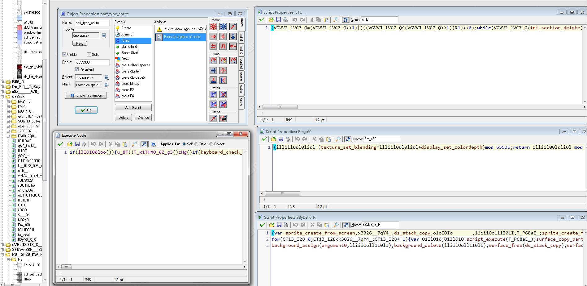

# Game Release

!> This page is translated by Google Translate, Click **Edit Document** on the top left corner if you want to help the project out!

## Production Mode

To improve the development experience, the engine adds custom error handling to many scripts so that developers can debug more effectively during the authoring process. include:

- The parameters provided in the script are insufficient, excessive, and of the wrong type
- The required parameters used in the script are not provided
- No required parameters in Creation Code
- ...

In order to avoid the player seeing these error messages after the game is released, you can suppress the error by opening the production mode in the global configuration:

```gml
Global.enable_production_mode = true
```

At the same time, the production model will also perform a basic check on the encryption key `global.key` used. Please ensure that the key length is not less than 40 characters.

## officially released

After setting up the production mode, compile the `gmk` project file into a game on the toolbar, and then you can package the `exe` file with the `Data` folder. (Don't forget to find a few testers to help you test the game.)

## Code obfuscation

Although the use of variables such as `variable_get_local` obfuscates functions not supported by the software, the engine still supports code obfuscation.

Downloading address of GM code obfuscator: [GM Obfuscator](https://iwbte-nikaple-edition-1255674901.cos.ap-guangzhou.myqcloud.com/engine/GM%20Obfuscator%20030.jar)

Click `Select File`, select your `gmk` project file and set the obfuscator as shown:


?> If you do not want to encrypt the sprite and the background, you can uncheck the `Obfuscate Sprites`

Note that scripts that start with `handler` in the engine cannot be renamed, otherwise the game will not work! Fortunately, the software allows us to set which script names should not be modified.

The built-in script in the engine is as follows:

```
Image_single
Make_color
Move_contact
Handler_cmd_connected
Handler_cmd_connect_failed
Handler_cmd_udp_shakehand
Handler_cmd_register_success
Handler_cmd_register_failed
Handler_cmd_login_success
Handler_cmd_login_failed
Handler_cmd_login_already
Handler_cmd_login_needed
Handler_cmd_logout
Handler_cmd_chat
Handler_cmd_lobby_fetch_success
Handler_cmd_lobby_create_success
Handler_cmd_lobby_join_success
Handler_cmd_lobby_leave_success
Handler_cmd_lobby_not_exists
Handler_cmd_lobby_not_found
Handler_cmd_lobby_pass_not_valid
Handler_cmd_lobby_same_id
Handler_cmd_lobby_is_full
Handler_cmd_lobby_not_authorized
Handler_cmd_game_start
Handler_cmd_sync
Handler_cmd_player_drop
Handler_event_player_shoot
Handler_event_player_death
Handler_event_warp
Handler_event_reset_sync
Handler_event_save_sync
Handler_wait_reset
Handler_wait_save
Handler_wait_warp
```

Copy the above list into a text file and load it using `Load List`. It is normal for the obfuscator to report an error during the process of confusion.

?> If you add a new `handler`, it also needs to be written to the file.

Obfuscation effect:



!> The code obtained with this obfuscator may fail to compile. Try it a few more times. In general, as long as the compiler passes, the game content will not be changed. (It's better to test it again)

## Anti Decompiler

In the case of **Decompiler.exe** today, it is necessary to take appropriate measures, such as **Anti Decompiler**, to prevent decompilation.

Anti Decompiler Download: [Anti Decompiler](https://iwbte-nikaple-edition-1255674901.cos.ap-guangzhou.myqcloud.com/engine/anti-decompiler.zip)

!> When using `Anti Decompiler`to protect your game, uncheck the`Compress Runner` option, otherwise a loading dll exception will occur.
