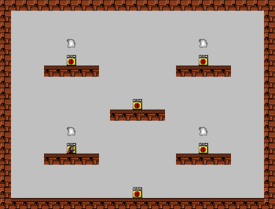
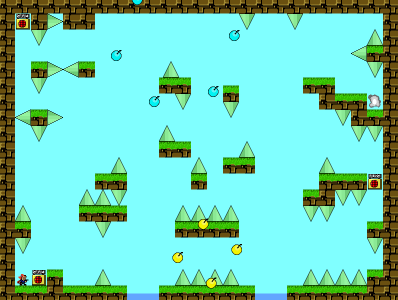
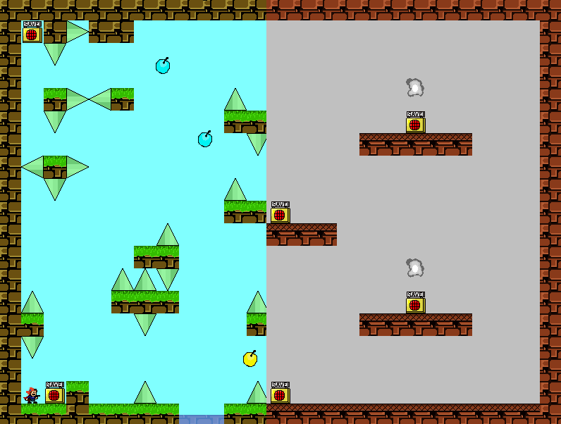
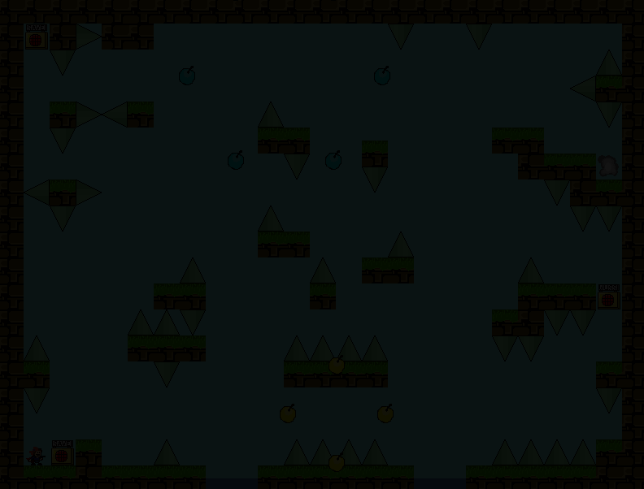

# Transition effect

!> This page is translated by Google Translate, Click **Edit Document** on the top left corner if you want to help the project out!

Take the transition from room  to  as an example:

GM's built-in room transition effects:

- 0 = no effect
- 1 = Create from the left:

- 2 = Created from the right
- 3 = Create from above
- 4 = Create from below
- 5 = Center Creation
- 6 = move from left:

- 7 = move from right
- 8 = Move from above
- 9 = move from below
- 10 = From the left:

- 11 = Interlaced from right
- 12 = Interlaced from above
- 13 = From the next interlace
- 14 = Push from the left:

- 15 = Push from right
- 16 = Push up
- 17 = Push down
- 18 = left turn

- 19 = Right turn
- 20 = Mixed Room

- 21 = fade in

