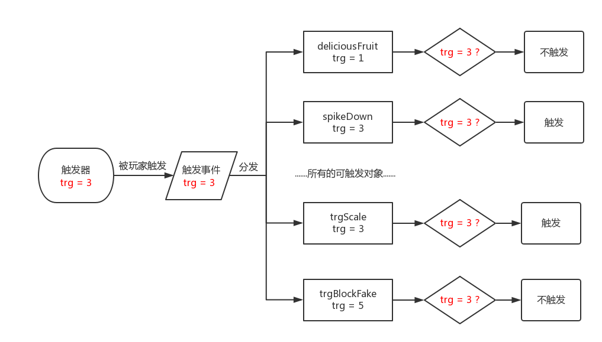
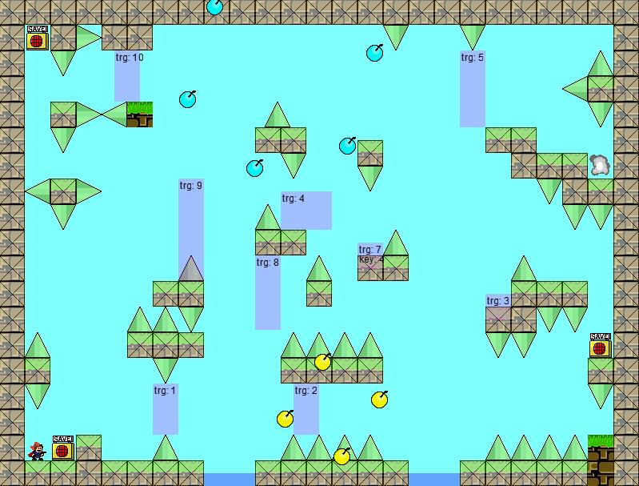
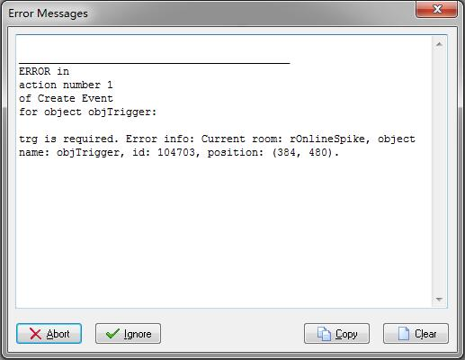

# New trigger system

!> This page is translated by Google Translate, Click **Edit Document** on the top left corner if you want to help the project out!

Triggering is the basis for the realization of various pits in I Wanna. If the engine version 2.0 rewrites the trigger system to improve runtime efficiency, it is almost identical to the original. [View instructions for use] (/trigger?id=trg-integral with -key-)

## Introduction

The trigger system mainly contains two kinds of object: triggers and trigger objects, which are linked together by `trigger events'. The operation of the system can be summarized as the following figure:



- A trigger refers to an object that responds to the `player` action. It can emit a `trigger event' with a certain tag (`trg`) under certain conditions. include:

- An invisible `trigger` that emits a `trigger event` when `player` collides with it;
    - Delayed `trigger`, when `player` collides with it, then emit `trigger event` after some time;
    - A visible `button` that emits a `trigger event` when the `player` shot hits;
    - ...

- The trigger object is an object that can respond to the `trigger event`, including:

- The thorn that will move after the trigger
    - Boards that will move after triggering
    - Invisible brick that will be created after triggering
    - Any object that will do anything after triggering

## trg integration with key

In previous versions, `keyTrigger` was often used in the back-end pit because it did not respond to any of the `player` actions until the `freeTrigger` of `trg` was fired. In version 2.0, `freeTrigger` was merged with `keyTrigger` for `objTrigger`. The use of `objTrigger` is exactly the same as `freeTrigger`. Also, when `key` is specified in `Creation Code`, it can be used as `keyTrigger`.

Ordinary objTrigger:

```gml
trg = 1
ys = 6
```

Used as a keyTrigger:

```gml
trg = 2
key = 1
ys = 6
```

In order to more easily debug the triggering mechanism, `objTrigger` will have some additional processing under [Debug mode] (trigger?id=Debug mode and error reporting).

## PlayerKiller can be triggered?

This is the most obvious change in the triggering system in the 2.0 version of the nikaple engine. You can place any `playerKiller` in the room and use `trg` to trigger it. Supports 4 modes:

- Speed
- Path
- Zoom
- Rotate

### speed mode

After the trigger, it will move at the specified speed. There are two trigger modes:

- Horizontal/vertical speed trigger:

Creation Code Parameter:

```gml
// Required, trigger number
trg = 1
// Optional, lateral speed
h = 4
// Optional, vertical speed
v = 4
```

- Speed/direction trigger:

Creation Code Parameter:

```gml
// Required, trigger number
trg = 1
// Required, speed
spd = 6
// Optional, direction, default to right
dir = 45
```

### path mode

After the trigger, it will follow a given path.

Creation Code Parameter:

```gml
// Required, trigger number
trg = 1
// Required, path name
pth = pCircle
// Required, path movement speed
spd = 5
// Optional, path scaling
scl = 1
// Optional, path end action
enda = PATH_ACTION_STOP
// Whether to prevent spoilers (the player will move in the current direction after death, not stop/turn)
move = true
```

### zoom mode

After the trigger, zoom in/out with reference to the specified center. The public parameters are as follows:

Creation Code:

```gml
// Required, trigger number
trg = 1
// At least one of tarx / tary is not empty
// Optional, scale in x
tarx = 3
// Optional, y scale
tary = 3
// Optional, use the sprite
spr = sprSpikeUp
// Optional, quickly set the zoom center (will be overwritten by cx/cy)
origin = 5
// Optional, lateral offset of zoom center and sprite center
cx = 0
// Optional, vertical offset of zoom center and sprite center
cy = 0
```

Among them, the value of origin is 1 - 9, corresponding to the upper left corner of the wizard, the upper middle, the upper right corner ... see below:

```
1 2 3
4 5 6
7 8 9
```

There are two trigger modes:

- Zoom time trigger:

Creation Code Parameter:

```gml
// Required, the time (frame) to zoom to the target zoom amount
time = 50
```

- x, y zoom speed trigger:

Creation Code Parameter:

```gml
// Both xsp and ysp cannot be empty
// Speed ​​of zooming in x direction after trigger
xsp = 0.04
// The speed of zooming in the y direction after the trigger
ysp = 0.04
```

For additional explanation of these parameters:

Suppose you need to scale a thorn to 3 times its original size in 1 second, then tarx and tary all have a value of 3.

- For scaling time mode, time = 50;
- For the zoom speed mode, the values ​​of xsp and ysp are: (3 – 1) / 50 = 0.04.

### rotation mode

After the trigger, it will rotate a certain angle along the specified center.

Creation Code Parameter:

```gml
// Required, trigger number
trg = 7
// Required, rotation angle
angle = 90
// Required, rotation time
time = 20
// Optional, use the sprite
spr = sprSpikeUp
// Optional, quickly set the zoom center (will be overwritten by cx/cy)
origin = 5
// Optional, lateral offset of center of rotation and spr center
cx = 0
// Optional, vertical offset of center of rotation and spr center
cy = 0
```

Among them, the value of origin is 1 - 9, corresponding to the upper left corner of the wizard, the upper middle, the upper right corner ... see below:

```
1 2 3
4 5 6
7 8 9
```

?> When playerKiller is placed directly outside the room, the engine will automatically set `noDes = true` to ensure that it is created correctly.

## timing trigger

The object can be found under `Objects -> triggers -> objSequenceTrigger`. Used to trigger some pits in a specific order.

Application scenario example:

`player` triggers a `trigger event` that triggers `trg = 1` and a trigger event `trg = 2` after 1 second.

```gml
Trg[1] = 1
Time[1] = 50
Trg[2] = 2
```

`player` does not trigger any events when it touches, triggers a trigger event of `trg = 1` after 1 second, triggers a trigger event of `trg = 2` after 3 seconds:

```gml
Trg[1] = 9999
Time[1] = 50
Trg[2] = 1
Time[2] = 100
Trg[3] = 2
```

## debug mode and error

When the game is running in debug mode, `objTrigger` displays the current `trg` and `key` for viewing:



When there is no `trg` in `Creation Code` of `objTrigger` and object, the engine catches this type of error and throws an error such as:



Add the necessary parameters to the `Creation Code` of `objTrigger`at`rOnlineSpike` (384, 480).
