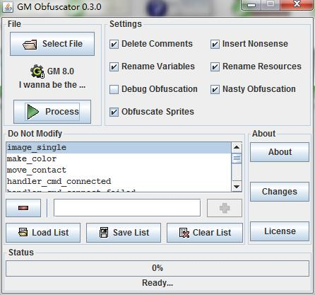

# 游戏发布

## 生产模式

为了提高开发体验，果引擎在许多脚本中都加入了自定义的错误处理，以便开发者在创作过程中更有效地 debug。这包括：

* 脚本中提供的参数不足、过量、类型错误
* 未提供脚本中用到的必需参数
* 未提供 `Creation Code` 中的必需参数
* ...

为了避免游戏发布之后玩家看到这些错误信息，你可以通过在全局配置中打开生产模式来抑制报错：

```gml
global.enable_production_mode = true
```

同时，生产模式中也会对使用的加密密钥进行基础检查，请保证密钥长度不小于 40 个字符。

## 正式发布

设置好生产模式之后，在工具栏中将 `gmk` 工程文件编译为游戏，随后将 `exe` 文件与 `Data` 文件夹一起打包发布即可。（别忘了找几个测试员帮你测试游戏哦）

## 代码混淆

虽然使用了 `variable_get_local` 等代码混淆软件不支持的函数，果引擎仍然代码混淆。

GM Obfuscator 下载地址：[GM Obfuscator](http://p9wc9w6dq.bkt.clouddn.com/GM%20Obfuscator%20030.jar)

单击 `Select File`，并如图设置混淆器：



?> 如果不想加密精灵与背景，可以取消勾选 `Obfuscate Sprites`

注意，引擎中以 `handler` 开头的脚本均不能被改名，否则游戏将无法运行！幸运的是，该软件允许我们设置哪些脚本名称不应该被修改。

引擎中内置的脚本如下：

```
image_single
make_color
move_contact
handler_cmd_connected
handler_cmd_connect_failed
handler_cmd_udp_shakehand
handler_cmd_register_success
handler_cmd_register_failed
handler_cmd_login_success
handler_cmd_login_failed
handler_cmd_login_already
handler_cmd_login_needed
handler_cmd_logout
handler_cmd_chat
handler_cmd_lobby_fetch_success
handler_cmd_lobby_create_success
handler_cmd_lobby_join_success
handler_cmd_lobby_leave_success
handler_cmd_lobby_not_exists
handler_cmd_lobby_not_found
handler_cmd_lobby_pass_not_valid
handler_cmd_lobby_same_id
handler_cmd_lobby_is_full
handler_cmd_lobby_not_authorized
handler_cmd_game_start
handler_cmd_sync
handler_cmd_player_drop
handler_event_player_shoot
handler_event_player_death
handler_event_warp
handler_event_reset_sync
handler_event_save_sync
handler_event_boss_hit
handler_wait_reset
handler_wait_save
handler_wait_warp
```

将上述列表复制到一个文本文件中，使用 `Load List` 载入即可。

!> 利用该混淆器得到的代码有可能会编译失败，多试几次即可。一般来说，只要编译通过，游戏内容不会被改变。

## Anti Decompiler

在如今人手一份 **Decompiler.exe** 的情况下，采用适当的措施，例如 **Anti Decompiler**，来防止反编译是十分必要的。

Anti Decompiler 下载地址：[Anti Decompiler](http://p9wc9w6dq.bkt.clouddn.com/anti-decompiler.zip)

!> 在使用 `Anti Decompiler` 保护你游戏的时候，请将 `Compress Runner` 选项取消勾选，否则会出现载入 dll 异常。
