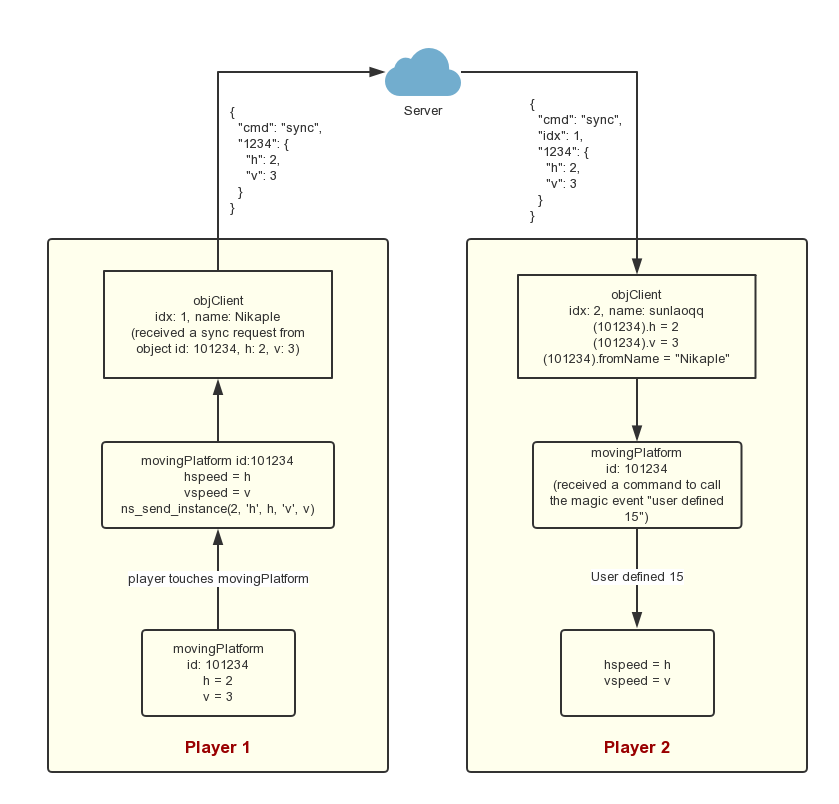
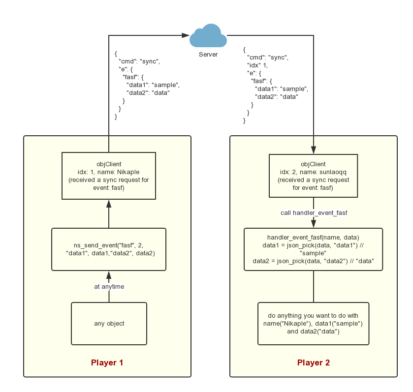
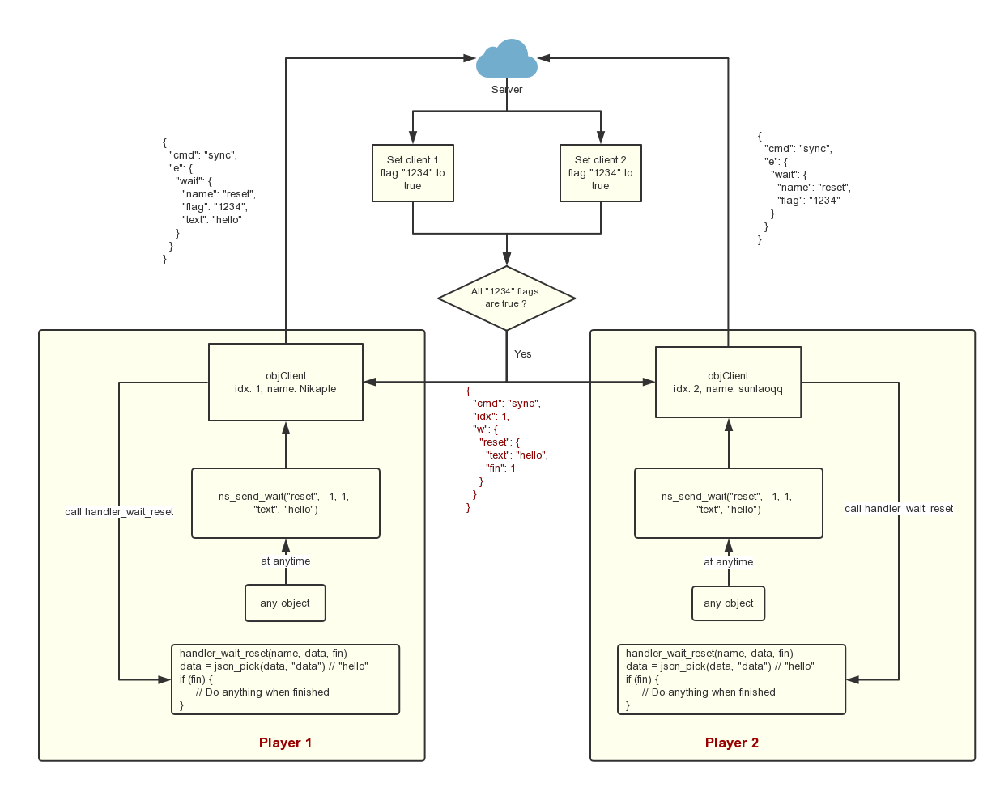

# Script 文档

## Functions

#### setGlobals()

全局配置项。

#### setGlobalsMinor()

一些修改可能性较低的配置项。

全局配置详见[全局设定](global.md)。总表如下：

| 配置名                             | 用途                         | 默认值                                | 可选值/类型/说明                                                                    |
| ---------------------------------- | ---------------------------- | ------------------------------------- | ----------------------------------------------------------------------------------- |
| global.game_title                  | 设置游戏标题                 | I wanna be the Engine Nikaple Edition | 字符串                                                                              |
| global.game_mode                   | 设置游戏模式                 | MODE_USER<br />\_SELECT               | MODE_SINGLE_PLAYER<br />MODE_TOURNAMENT<br />MODE_COOPERATION<br />MODE_USER_SELECT |
| global.first_stage                 | 设置游戏正式开始时的初始房间 | rHub                                  | 房间名                                                                              |
| global.enable_production_mode      | 是否开启生产模式             | false                                 | true/false                                                                          |
| global.enable_internationalization | 是否启用多语言               | true                                  | true/false                                                                          |
| global.default_language            | 语言设定                     | LANG_CN                               | LANG_CN, LANG_EN, LANG_JP                                                           |
| global.encoding                    | 文字编码                     | gb2312                                | 编码名称                                                                            |
| global.key                         | 加密密钥                     | "huYJ...GBTS"                         | 长度不小于 40 的字符串                                                              |
| global.ip_address                  | 服务器 IP 地址               | 139.\*.\*.59                          | ip 地址                                                                             |
| global.max_sync_cycle              | 同步周期                     | 3                                     | 正整数                                                                              |
| global.enable_lite_mode            | 是否开启轻量化模式           | false                                 | true/false                                                                          |
| global.debug_host_name             | 调试主机玩家名               | "username"                            | 字符串                                                                              |
| global.debug_host_pass             | 调试主机密码                 | "password"                            | 字符串                                                                              |
| global.debug_guest_name            | 调试非主机玩家名             | "test"                                | 字符串                                                                              |
| global.debug_guest_pass            | 调试非主机密码               | "test"                                | 字符串                                                                              |
| global.tcp_port                    | 服务器 TCP 端口              | 3738                                  | 端口号                                                                              |
| global.udp_port                    | 服务器 UDP 端口              | 3738                                  | 端口号                                                                              |
| global.enable_stream_music         | 是否使用流式播放音乐         | true                                  | true/false                                                                          |
| global.enable_builtin_drawing      | 是否使用内置绘图函数         | false                                 | true/false                                                                          |
| global.game_room_width             | 窗口宽度                     | 800                                   | 正整数                                                                              |
| global.game_room_height            | 窗口高度                     | 608                                   | 正整数                                                                              |
| global.enable_encryption           | 存档文件是否加密             | true                                  | true/false                                                                          |
| global.enable_focus                | 是否使用键盘模拟聚焦模式     | true                                  | true/false                                                                          |
| global.focus_key_code              | 使用键盘模拟聚焦的键码       | 1                                     | 键码                                                                                |
| global.frame_rate                  | 游戏帧率                     | 50                                    | 正整数                                                                              |
| global.enable_pause_in_boss_room   | BOSS 房间内是否允许暂停      | false                                 | true/false                                                                          |
| global.enable_jump_cancel          | 是否允许跳跃取消（JC）       | false                                 | true/false                                                                          |
| global.enable_fullscreen           | 是否允许按 F4 全屏           | true                                  | true/false                                                                          |
| global.enable_keypad               | 是否允许使用小键盘           | true                                  | true/false                                                                          |
| global.enable_auto_spike_sprite    | 是否自动更换刺的精灵         | true                                  | true/false                                                                          |
| global.enable_auto_tile            | 是否自动贴图                 | true                                  | true/false                                                                          |
| global.boss_number                 | BOSS 数量上限                | 64                                    | 正整数                                                                              |
| global.item_number                 | 道具数量上限                 | 64                                    | 正整数                                                                              |
| global.data_number                 | 自定义数据数量上限           | 64                                    | 正整数                                                                              |
| global.text_number                 | 自定义字符串上限             | 64                                    | 正整数                                                                              |
| global.saving_directory            | 存档保存路径                 | "Data/Save"                           | 字符串                                                                              |
| global.music_directory             | 音乐读取路径                 | "Data/Music"                          | 字符串                                                                              |
| global.sound_directory             | 音效读取路径                 | "Data/Sound"                          | 字符串                                                                              |
| global.plugin_directory            | 插件读取路径                 | "Data/Plugin"                         | 字符串                                                                              |
| global.font_directory              | 字体读取路径                 | "Data/Font"                           | 字符串                                                                              |
| global.option_file_name            | 配置文件名                   | "options.ini"                         | 字符串                                                                              |

#### scrSealRoom(noTop, noLeft, noBottom, noRight)

将房间的四周用砖块密封。

- noTop：是否不封顶
- noLeft：是否不封左侧
- noBottom：是否不封底
- noRight：是否不封右侧

#### fadeIn(time)

在 step 事件中使用，实现 obj 的淡入效果。

- time： obj 淡入所经过的时间（帧），默认为 10（1 帧 = 0.02 秒）。

?> 在使用这个脚本之前，务必先把当前 obj 的不透明度 `image_alpha` 设置为 0。

#### fadeOut(time)

在 step 事件中使用，实现 obj 的淡出效果。

- time：obj 淡出所经过的时间（帧），默认为 10（1 帧 = 0.02 秒） 。

?> 如果不透明度或尺寸降低到 0 以下，则会摧毁当前 obj。

#### flashObject(flash_time, flash_count)

使当前 obj 进入闪烁，并将变量“flash”设置为 `true`。

当闪烁结束后，flash 变量会自动回到 0，这在设置 boss 被子弹击中事件的时候十分有用。

- flash_time：闪烁一次所需要的时间；
- flash_count: 总共闪烁次数。

#### splitObject(number, speed, object, direction, sprite)

生成一圈相同的 `obj` 向外发散。

- number：生成 `obj` 的总数；
- speed：生成 `obj` 的速度；
- object：生成 `obj` 的名字；
- direction：第一个 `obj` 瞄准的方向；
- sprite：生成 `obj` 的精灵名称（可选） 。

其中，如果将 direction 设置为-1，生成 obj 的方向将是随机的；如果将 direction 设置为 1，生成 obj 的方向将瞄准 player；如果将 direction 设置为其他值，则会瞄准所指定的方向

?> GM 中的方向：向右为 0，向上为 90，逆时针为正

#### autoSpikeSprite

参见 [自动更换刺的精灵](autosprite.md)

#### screenShake(time, shakeX, shakeY)

产生一个震屏效果。

- time：震屏效果的持续时间（帧）；
- shakeX：横向震动的振幅；
- shakeY：纵向震动的振幅。

#### screenFlash(time)

产生一个屏幕闪白效果。

- time：闪白效果的持续时间（帧）。

#### createShadow(alpha_speed, scale_speed)

产生拖影效果， 常用于 alarm 事件并重复调用。

- alpha_speed：每步影子不透明度的减小量；
- scale_speed：每步影子大小的减小量。

例如：`objBossBullet` 的 `Alarm 0` 事件：

```gml
createShadow(0.1, 0);
alarm[0] = 2;
```

#### setScale(xscale,yscale)

设置 obj 在 x、y 方向上的拉伸量。现已被 `xs`，`ys` 这两个参数取代。

- xscale：x 方向拉伸量
- yscale: y 方向拉伸量

## Music

详见[音乐播放](music.md)

#### music_init()

在这里初始化音乐。

#### music_config()

在这里设置每个房间中要播放的音乐。

#### music_load(file)

载入一段外部音乐，格式必须为 `ogg`。

#### music_play(id)

播放音乐或音效。`id` 来自 `music_load` 或 `gmk` 中的声音资源。

#### music_stop(id)

停止音乐或音效。`id` 来自 `music_load` 或 `gmk` 中的声音资源。

#### music_loop(id)

循环播放音乐。`id` 来自 `music_load`。

#### music_pause(id)

暂停音乐。`id` 来自 `music_load`。

#### music_resume(id)

继续播放音乐。`id` 来自 `music_load`。

## Network

### ns

`ns` 即 `Nikaple Server`，是果引擎联机功能的核心部分。在查看文档之前，可以先看看联机系统的[简介](network.md)。

它可分为 5 个主要的部分：

- ns_get：获取游戏信息；
- ns_is：判别游戏状态；
- ns_actions：执行一些操作，例如注册、登录、加入房间等；
- ns_send：向服务器同步信息（使用 TCP 协议，常用）；
- ns_sync：向服务器同步信息（使用 UDP 协议，不常用）。

#### ns_get

| 脚本名                          | 用途                                                      |
| ------------------------------- | --------------------------------------------------------- |
| ns_get_player_name()            | 获取当前玩家的名称（玩家名）                              |
| ns_get_player_index()           | 获取当前玩家在游戏内的编号（1 为房主，大于 1 均为非房主） |
| ns_get_other_player_name(index) | 根据其他玩家的编号获取名称                                |
| ns_get_other_player_index(name) | 根据其他玩家的名称获取编号                                |
| ns_get_lobby_id()               | 获取当前房间 ID ，如果不存在则返回 0。                    |
| ns_get_lobby_name()             | 获取当前房间名，如果不存在则返回空字符串。                |
| ns_get_game_id()                | 获取当前游戏在服务器端的编号。                            |

#### ns_is

| 脚本名              | 用途                 |
| ------------------- | -------------------- |
| ns_is_online_mode() | 是否为联机模式？     |
| ns_is_connected()   | 是否已连接到服务器？ |
| ns_is_logged_in()   | 是否已登录？         |
| ns_is_in_lobby()    | 是否在房间中？       |
| ns_is_host()        | 是否是房主？         |
| ns_is_guest()       | 是否为非房主？       |
| ns_is_in_game()     | 是否在游戏中？       |

#### ns_actions

| 脚本名            | 用途                               |
| ----------------- | ---------------------------------- |
| ns_register()     | 注册                               |
| ns_login()        | 登录                               |
| ns_logout()       | 登出                               |
| ns_set_data()     | 设置额外的玩家信息（例如分数）     |
| ns_get_data()     | 获取额外的玩家信息（例如分数）     |
| ns_get_all_data() | 获取所有玩家的额外信息（例如分数） |
| ns_fetch_lobby()  | 查询房间列表                       |
| ns_create_lobby() | 创建房间                           |
| ns_join_lobby()   | 加入房间                           |
| ns_leave_lobby()  | 离开房间                           |
| ns_start_game()   | 开始游戏                           |

##### ns_set_data(dataCount, k1, v1, k2, v2, ..., kn, vn)

设置额外的玩家信息（例如分数）

- 第一个参数为设置信息的数量 n；
- 紧接着的 2n 个参数为形如 key<sub>1</sub>, value<sub>1</sub>, key<sub>2</sub>, value<sub>2</sub>, ..., key<sub>n</sub>, value<sub>n</sub> 的键值对。

!> 该函数的返回值必须通过调用该脚本的 `obj` 的 `User Defined 11` 事件获取，如果成功，`success` 变量为 `true`，返回的值储存在 `data` 变量中；否则 `success` 变量为 `false`，错误信息保存在 `msg` 变量中。

例如：

Create:

```gml
// 为当前玩家设置两条信息： `exam` 为 `Math` ，`score` 为 `150`
ns_set_data(
  2,
  'exam', 'Math',
  'score', 150,
)
```

User defined 11:

```gml
if (success) {
  // 成功保存
  _score = string(json_pick(data, 'score'))
  exam = json_pick(data, 'exam')
  show_message('You got ' + string(_score) + ' in ' + exam + ' exam!')
} else {
  // 保存失败，可以在这里进行重试，或者提醒玩家
  ns_set_data(2, 'exam', 'Math', 'score', 150)
  show_message('Set data failed. Msg: ' + msg)
}
```

##### ns_get_data(keys)

获取额外的玩家信息（例如分数）

- keys 参数为获取额外信息的键名，以 "|" 分隔（详见下）

keys 参数说明：
如果需要获取键名为 `data1` 、 `data2` 、 `data3` 的数据，则应传入 'data1|data2|data3'

!> 该函数的返回值必须通过调用该脚本的 `obj` 的 `User Defined 12` 事件获取，如果成功，`success` 变量为 `true`，则信息会储存在各变量中（见示例）；否则 `success` 变量为 `false`，错误信息保存在 `msg` 变量中。

例如：

Create:

```gml
// 获取所有信息
ns_get_data()
// 只获取 score 信息
ns_get_data('score')
```

User defined 12:

```gml
if (success) {
  show_message('Your score is ' + string(score) + '!')
} else {
  // 获取失败，可以在这里进行重试，或者提醒玩家
  ns_get_data()
}
```

##### ns_get_global_data(keys)

获取服务器的全局配置信息（例如版本）

- keys 参数为获取额外信息的键名，以 "|" 分隔（详见下）

keys 参数说明：
如果需要获取键名为 `data1` 、 `data2` 、 `data3` 的数据，则应传入 'data1|data2|data3'

!> 该函数的返回值必须通过调用该脚本的 `obj` 的 `User Defined 12` 事件获取，如果成功，`success` 变量为 `true`，则信息会储存在各变量中（见示例）；否则 `success` 变量为 `false`，错误信息保存在 `msg` 变量中。

例如：

Create:

```gml
// 获取当前版本
ns_get_global_data('version')
```

User defined 12:

```gml
if (success) {
  show_message('Current version is: v' + string(score) + '!')
} else {
  // 获取失败，可以在这里进行重试，或者提醒玩家
  show_message('Version get failed. You can only play in single player mode.')
}
```

##### ns_get_all_data(keys, sortBy, order, from, to)

获取所有玩家的额外信息（例如分数）

- keys 为获取额外信息的键名，以 "|" 分隔（详见下）
- sortBy 为参与排序字段名称
- order 为顺序，可选值有两个：'asc' 为升序，'desc' 为降序
- from, to: 将返回值从 `from` 截断到 `to`（不包括 `to`，从 0 开始计数），例如 `from=5&to=8` 则会返回列表中第 6-8 项

keys 参数说明：
如果需要获取名为 `data1` 、 `data2` 、 `data3` 的数据，则应传入 'data1|data2|data3'

?> 该函数的返回值必须通过调用该脚本的 `obj` 的 `User Defined 12` 事件获取：如果成功，`success` 变量为 `true`，信息会储存在变量 `data[i]` 中，data 数组中元素的个数储存在 size 变量中（具体使用方法见下面的示例）；如果失败，`success` 变量为 `false`，错误信息保存在 `msg` 变量中。

!> 注意 obj 自带变量不要使用 data/msg/success，否则会发生覆盖！

假设数据库中当前数据如下：

```json
[
  {
    "name": "Nikaple",
    "number": 1,
    "letter": "n",
    "chinese": "在"
  },
  {
    "name": "Sunlaoqq",
    "number": 3738,
    "letter": "a",
    "chinese": "好"
  },
  {
    "name": "老虎",
    "number": 999,
    "letter": "z",
    "chinese": "啊"
  }
]
```

那么会有以下结果：

```gml
ns_get_all_data('number', 'number', 'desc')
/*
获取 number 值，并降序排列
[
  {
    "name": "Sunlaoqq",
    "number": 3738,
  }, {
    "name": "老虎",
    "number": 999,
  }, {
    "name": "Nikaple",
    "number": 1,
  }
]
*/
ns_get_all_data('number|letter', 'letter', 'asc', 0, 2)
/*
获取 number 与 letter 的值，按 letter 升序排列，只取前两位
[
  {
    "name": "Sunlaoqq",
    "number": 3738,
    "letter": "a",
  }, {
    "name": "Nikaple",
    "number": 1,
    "letter": "n",
  }
]
*/
ns_get_all_data('number|letter|chinese', 'chinese', 'asc', 2, 3)
/*
获取 number、letter 与 chinese 的值，按照拼音顺序升序排列，只取第三位
[
  {
    "name": "Sunlaoqq",
    "number": 3738,
    "letter": "a",
    "chinese": "好"
  }
]
*/
```

使用示例：

Create:

```gml
// 获取高分榜前十名的信息，以分数降序排列
ns_get_all_data('name|score|updateAt', 'score', 'desc', 0, 10)
```

User defined 12:

```gml
if (success) {
  // 收到数据后，开始绘制最高分
  shouldDrawHighscore = true
  // 遍历数组
  for (i = 0; i < size; i += 1) {
    // 提取相应字段的信息
    name[i] = json_pick(data[i], 'name')
    _score[i] = json_pick(data[i], 'score')
    time[i] = json_pick(data[i], 'updateAt')
    // 在 draw 事件中利用 name[i], _score[i], time[i] 绘制最高分
  }
} else {
  show_message('获取排行榜失败')
}
```

!> 注意，请不要在 User defined 12 事件之外直接使用 data[i] 变量！为了避免出现内存泄漏，引擎会在网络数据获取完成之后自动释放其中的 ds_map/ds_list，所以在其他事件中使用则会出现 `Data structure with index does not exist.` 错误。

#### ns_send

##### ns_send(cmd)

直接向服务器发送请求（基本用不着）

##### ns_send_instance

该函数的运行机制如下图所示：



##### ns_send_event

该函数的运行机制如下图所示：



##### ns_send_wait

该函数的运行机制如下图所示：



关于这三个脚本的详细使用方法，参见 [联机简介](network.md)

##### ns_send_instance_direct(ds_map)

##### ns_send_event_direct(ds_map)

##### ns_send_wait_direct(ds_map)

有时， `ns_send_instance`、`ns_send_event`、`ns_send_wait` 这三个脚本可能并不能满足你的需求，这可能是因为：

- 仅在某些条件下添加属性，以减小传输大小；
- 因为 `GM` 最多支持 16 个参数，添加的属性有可能超过参数上限。

此时 `ns_send_*_direct` 系列函数则恰好派上用场。它们均接收一个 `cmd`，代表需要同步的属性。

例如，在 `player` 的 `alarm[11]` 中，同步当前房间：

```gml
// 创建一个含有 5 个元素的 ds_map
eventMap = cmd_init(
    4,
    'r', room,
    'x', x,
    'y', floor(y),
    'xs', image_xscale,
)
// 选择性添加 rev 与 sync
cmd_add_if_exists(
  eventMap, 2,
  'sync', global.__sync_position,
  'rev', global.reverse
)
// 直接将该 ds_map 作为事件发送
ns_send_event_direct('warp', eventMap)
// 不需要手动调用 ds_map_destroy
```

```gml
// 如果需要同步的属性太多，可以首先添加 7 个：
eventMap = cmd_init(
  7,
  'a', 1,
  'b', 2,
  'c', 3,
  'd', 4,
  'e', 5,
  'f', 6,
  'g', 7
)
// 接着继续添加
cmd_add(
  eventMap, 2,
  'h', 8,
  'i', 9
)
// 这样就可以发送一个带有 9 个属性的事件了
ns_send_instance_direct(eventMap)
```

#### ns_sync

##### ns_sync_begin

利用 UDP 协议同步其他 `object` 时需要用到。详见：[使用 UDP 同步](/network?id=使用-udp-来同步)

##### ns_sync_player

利用 UDP 协议同步 `player`，一般不用修改。

### handler

该文件夹下存放各类事件处理器。

#### commands

处理普通指令

| 脚本名                           | 事件名             |
| -------------------------------- | ------------------ |
| handler_cmd_connected            | 服务器连接成功     |
| handler_cmd_connect_failed       | 服务器连接失败     |
| handler_cmd_udp_shakehand        | UDP 握手成功       |
| handler_cmd_register_success     | 注册成功           |
| handler_cmd_register_failed      | 注册失败           |
| handler_cmd_login_success        | 登录成功           |
| handler_cmd_login_failed         | 登录失败           |
| handler_cmd_login_already        | 已经登录           |
| handler_cmd_login_needed         | 需要登录才能继续   |
| handler_cmd_logout               | 登出成功           |
| handler_cmd_lobby_fetch_success  | 成功加载房间列表   |
| handler_cmd_lobby_create_success | 成功创建房间       |
| handler_cmd_lobby_join_success   | 成功加入房间       |
| handler_cmd_lobby_leave_success  | 成功离开房间       |
| handler_cmd_lobby_not_exists     | 房间号不存在       |
| handler_cmd_lobby_not_found      | 退出了不存在的房间 |
| handler_cmd_lobby_pass_not_valid | 房间密码错误       |
| handler_cmd_lobby_same_id        | 重复加入房间       |
| handler_cmd_lobby_is_full        | 房间已满           |
| handler_cmd_lobby_not_authorized | 非房主开始游戏     |
| handler_cmd_game_start           | 房主开始游戏       |
| handler_cmd_sync                 | 同步游戏数据       |
| handler_cmd_player_drop          | 玩家掉线           |

#### event

处理事件同步指令

| 脚本名                     | 事件名         |
| -------------------------- | -------------- |
| handler_event_player_shoot | 玩家射击       |
| handler_event_player_death | 玩家死亡       |
| handler_event_warp         | 玩家传送或重置 |
| handler_event_reset_sync   | 同步重置       |
| handler_event_save_sync    | 同步存档       |

#### wait

处理等待事件同步指令

| 脚本名             | 事件名   |
| ------------------ | -------- |
| handler_wait_reset | 等待重置 |
| handler_wait_save  | 等待保存 |
| handler_wait_warp  | 等待传送 |

## Util

实用方法。

### ds_map

#### ds_map_init(kvCount, k1, v1, k2, v2, ..., kn, vn)

初始化一个 `ds_map`，返回 `id` 。

- 第一个参数为键值对的数量 n；
- 紧接着的 2n 个参数为形如 key<sub>1</sub>, value<sub>1</sub>, key<sub>2</sub>, value<sub>2</sub>, ..., key<sub>n</sub>, value<sub>n</sub> 的键值对。

#### ds_map_append(id, kvCount, k1, v1, k2, v2, ..., kn, vn)

向一个 `ds_map` 中追加键值对，返回 `id`。

- 第一个参数为 `ds_map` 的 `id`；
- 第一个参数为键值对的数量 n；
- 紧接着的 2n 个参数为形如 key<sub>1</sub>, value<sub>1</sub>, key<sub>2</sub>, value<sub>2</sub>, ..., key<sub>n</sub>, value<sub>n</sub> 的键值对。

#### ds_map_clone(id)

[浅克隆](https://baike.baidu.com/item/浅复制/12601426)一个 `ds_map`，返回新 `ds_map` 的 `id`。

#### ds_map_log(id)

以字符串形式输出一个 `ds_map`。

### ds_list

#### ds_list_init(itemCount, item1, item2, ..., itemn)

初始化一个 `ds_list`，返回 `id`。

- 第一个参数为列表中元素的数量 n；
- 紧接着的 n 个参数为需要添加进列表的元素。

#### ds_list_append(id, itemCount, item1, item2, ..., itemn)

向一个 `ds_list` 中追加元素，返回 `id` 。

- 第一个参数为 `ds_list` 的 `id`；
- 第一个参数为列表中元素的数量 n；
- 紧接着的 n 个参数为需要添加进列表的元素。

#### ds_list_clone(id)

[浅克隆](https://baike.baidu.com/item/浅复制/12601426)一个 `ds_list`，返回新 `ds_list` 的 `id`。

#### ds_list_log(id)

以字符串形式输出一个 `ds_list`

#### ds_list_remove(id, item)

从 `ds_list` 中移除值为 `item` 的第一个元素

#### ds_list_replace_item(id, item, newItem)

将 `ds_list` 中值为 `item` 的第一个元素替换为 `newItem`

### error

用于错误信息处理

| 脚本名称         | 用途                                                                  |
| ---------------- | --------------------------------------------------------------------- |
| ensure           | 确保某一变量存在（不为 0）                                            |
| error_ind_zero   | 确保以 0 为编号的某个资源不存在                                       |
| error_kv         | 使用 `cmd`、`ns_send` 等函数时没有声明 `kvCount`                      |
| error_item       | 使用 `cmd_list` 系列函数时没有声明 `itemCount`                        |
| error_kv_zero    | 使用 `cmd`、`ns_send` 等函数时，提供了比声明的 `kvCount` 更多的键值对 |
| error_arg_exceed | 参数个数太多                                                          |
| error_info       | 通用错误信息                                                          |

### 杂项

#### debug(str1, str2, str3, ...)

输出调试信息。详见 [调试功能](/debug?id=objdebug)

#### set_default(value, default)

用于设置默认值。

```gml
// 如果提供了 spr 则将 sprite_index 设为 spr，否则不变。
sprite_index = set_default(spr, sprite_index)
```

#### ensure_not_empty

验证玩家输入不能为空。

#### destroy_if_exists(obj)

如果 `obj` 存在则销毁 `obj`

#### clamp(x, a, b)

当 x < a 时返回 a，当 x > b 时返回 b，否则返回 x

#### is_zero

类型安全的验证是否为 0

## Draw

额外的绘制函数。

#### drawSelf

在 draw 事件中使用，用于绘制 obj 自身。 **当一个 obj 拥有 draw 事件时，它的精灵则不会自动绘制在屏幕上，这时就需要使用 drawSelf 函数来绘制该 obj 的原始精灵**。

例如在 `warp` (`roomChanger`) 中，需要同时绘制 `warp` 的精灵与 `warp` 上方的文字，所以 `draw_text` 绘制文字的同时你还需要调用 `drawSelf` 来绘制 `warp` 的精灵。

```gml
//draw the original sprite
drawSelf();
//draw the text
if (is_string(text)) {
  i18n_draw_set_font(fontMsyh12);
  i18n_draw_set_align(fa_center, fa_bottom)
  i18n_draw_text_ext_color(x + 16, y - 8, text, 8, -1, color, color, alpha);
}
```

#### drawLife(x1, y1, x2, y2, curVal, maxVal, col1, col2, outline)

在 draw 事件中使用，用于绘制血条。

- (x1,y1), (x2,y2)：血条左上角与右下角的坐标
- curVal：表示当前血量的变量
- maxVal：最大血量
- col1：满血时血条的颜色
- col2：空血时血条的颜色
- outline：是否绘制边框

`objHPBar - Draw Event`:

```gml
drawLife(
  40, 10, 760, 22,
  boss_obj.curHP, boss_obj.maxHP,
  c_lime, c_red, 1, c_black
);
```

#### draw_set_align(halign, valign)

快速设定文字横向与纵向对齐方式

#### draw_rectangle_view()

在当前视图中绘制矩形。无参数，color/alpha 需提前设定。

#### draw_rectangle_width(x1, y1, x2, y2, width)

绘制一个宽为 `width` 的矩形

#### draw_rectangle_single_color(x1, y1, x2, y2, color, outline)

绘制一个单色矩形

#### draw_text_transformed_outline(x, y, string, xscale, yscale, angle, outline_color, text_color)

绘制描边文字

- x, y 绘制位置
- string 文字
- xscale 水平缩放量
- yscale 竖直缩放量
- angle 文字角度
- outline_color 描边颜色
- text_color 文字颜色

## System

### Player

#### killPlayer

在任意时刻直接调用，可以让玩家立刻去世。

#### playerInit

对 `player` 的参数进行初始化。

- infJump：是否可以无限跳
- jump[1]：一段跳速度
- jump[2]：二段跳速度
- maxJumps：跳跃总数（会写入存档）
- maxSpeed：横向速度（会写入存档）
- grav：重力（会写入存档）
- shootInterval: 连射间隔（会写入存档）
- maxAirSpeed：最大下落速度
- maxWaterSpeed：水中最大下落速度

#### 其余 player 脚本

| 脚本名称            | 用途                 |
| ------------------- | -------------------- |
| playerSprite        | 设置精灵             |
| playerCheckKeyboard | 键盘按键检测         |
| playerMove          | 移动                 |
| playerJump          | 跳跃                 |
| playerVJump         | 跳跃相关             |
| playerWallJump      | 爬墙                 |
| playerPlatform      | 板碰撞相关           |
| playerColllideBlock | 砖碰撞相关           |
| playerReverse       | 翻转重力             |
| playerSync          | 同步信息             |
| playerForceSync     | 用于强制同步玩家位置 |
| playerMisc          | 杂项，如调试功能等   |

### World

| 脚本名称                 | 用途                         |
| ------------------------ | ---------------------------- |
| scrWorldInit             | 初始化                       |
| scrWorldInitPlugins      | 初始化插件                   |
| scrWorldInitMessageBox   | 初始化弹窗样式               |
| scrWorldInitRunCheck     | 运行前检查                   |
| scrWorldInitBlocks       | 初始化红蓝砖                 |
| scrWorldInitViews        | 初始化 View                  |
| scrWorldAppendDifficulty | 游戏标题中显示难度           |
| scrWorldUpdateCaption    | 更新游戏标题                 |
| scrWorldUpdateTime       | 更新游戏时间                 |
| scrWorldCleanmem         | 清理内存空间                 |
| scrWorldCenterMessage    | 消息窗口居中                 |
| scrWorldReset            | 重置游戏                     |
| scrWorldStopDeathSound   | 停止死亡音效                 |
| scrWorldPause            | 暂停游戏                     |
| scrWorldFixBug           | 解决按 R 时会微移 1 帧的 bug |
| scrWorldLoadGlobalSave   | 用于联机模式的同步存档       |

### Controls

### Save

#### saveGame()

保存游戏。详见 [新存档系统](save.md)

#### loadGame()

读取游戏。详见 [新存档系统](save.md)

#### saveDeathTime()

#### loadIcons()

### 杂项

#### spikeSprite(spr, miniSpr, image_speed)

用于[自动更换刺的精灵](autosprite.md)

#### getSaveFile(num)

获取编号为 `num` 的 save 文件名

#### gamePause()

暂停游戏

#### gameResume()

继续游戏

#### gameReset()

按 `F2` 的时候调用

#### isInGameRoom()

判断是否为游戏内房间（非标题、大厅、选择关卡等房间）

#### scrWarpTo(r, num, mode, width, height, clearSpeed, screens, kind)

参考 [Warp](objectref?id=warps-传送点)

## Lib

### audio

#### audio_init()

初始化 ini 配置文件，只需在游戏开始时调用一次即可，无需修改。

#### audio_update()

更新音乐配置，当改变音乐设置之后调用。

#### audio_setsoundvolume (add_volume)

增加/降低音效音量。audio_setsoundvolume(1) 则会将音效的音量提升 1 点。

#### audio_setmusicvolume (add_volume)

增加/降低音乐音量。audio_setmusicvolume(-1) 则会将音乐的音量降低 1 点。

#### audio_togglesoundmuted()

切换音效静音/非静音。

#### audio_togglemusicmuted()

切换音乐静音/非静音。

#### audio_playsound(sound)

用于播放音效（GM 中的 Sound 文件夹中的声音变量），这个脚本解决了 win8 的兼容性问题，所以播放音效请用这个脚本而不是直接 sound_play。由于使用了全局音量，所以声音文件的音量不能直接在 GM 中调整， 而需要在脚本前面给予一个值来调整默认音量。（按照范例来修正你自己的音效即可）

#### audio_playmusic(music)

播放外置音乐（参见第三节）

#### audio_loopmusic(music)

循环播放外置音乐（参见第三节）

#### audio_pausemusic(music)

暂停外置音乐

#### audio_resumemusic(music)

当音乐暂停时，继续播放音乐。

### i18n

#### i18n_init

初始化 i18n 多语言脚本。

#### i18n_font_init()

该脚本用于初始化所有的 `i18n 字体`。

#### i18n_font_load(name, size, bold, italic, underline)

从 `Data/Fonts` 目录下读取一个字体，返回其 id。

- name：字体文件名；
- size：字体大小；
- bold：是否粗体；
- italic：是否斜体；
- underline：是否加下划线。

#### i18n_font_add(name, cn, en, jp)

添加一个 `i18n 字体`。

- name：字体名称；
- cn：中文字体；
- en：英文字体；
- jp：日文字体。

#### i18n_add(i18n_id, cn, en, jp)

向 i18n 库中添加一个条目。

- i18n_id：i18n 标识符；
- cn：该标识符代表的中文字符串；
- ce：该标识符代表的英文字符串；
- jp：该标识符代表的日文字符串。

#### i18n_get(i18n_id)

取出当前语言下 i18n_id 代表的字符串

#### i18n_set_lang(lang)

设置当前语言为 `lang` 。可选值有：`LANG_CN`、`LANG_EN`、`LANG_JP`。

#### i18n_get_lang()

获取当前语言

#### i18n_free()

释放 i18n 模块的内存空间

#### i18n_auto_encoding()

该脚本在 `objEffectParent` 中调用，用于设置各种语言的编码。

#### i18n 拓展脚本列表

draw 系列以及 message 系列函数在前面加上 `i18n_` 即为对应的多语言内容。详见 [多语言支持](i18n.md)

| i18n 脚本                            | 对应的原生函数                  | 备注                     |
| ------------------------------------ | ------------------------------- | ------------------------ |
| i18n_draw_set_alpha                  | draw_set_alpha                  | 与原生函数完全一致       |
| i18n_draw_set_color                  | draw_set_color                  | 与原生函数完全一致       |
| i18n_draw_set_font                   | draw_set_font                   | 只能添加 i18n 字体       |
| i18n_draw_set_align                  | 无                              | 快速设置横向与纵向 align |
| i18n_draw_set_halign                 | draw_set_halign                 | 无                       |
| i18n_draw_set_valign                 | draw_set_valign                 | 无                       |
| i18n_draw_text                       | draw_text                       | 无                       |
| i18n_draw_text_ext                   | draw_text_ext                   | 无                       |
| i18n_draw_text_transformed           | draw_text_transformed           | 无                       |
| i18n_draw_text_ext_transformed       | draw_text_ext_transformed       | 无                       |
| i18n_draw_text_color                 | draw_text_color                 | 只能有两个 color         |
| i18n_draw_text_ext_color             | draw_text_ext_color             | 只能有两个 color         |
| i18n_draw_text_transformed_color     | draw_text_transformed_color     | 只能有两个 color         |
| i18n_draw_text_ext_transformed_color | draw_text_ext_transformed_color | 只能有两个 color         |
| i18n_string_width                    | string_width                    | 无                       |
| i18n_string_height                   | string_height                   | 无                       |
| i18n_string_width_ext                | string_width_ext                | 无                       |
| i18n_string_height_ext               | string_height_ext               | 无                       |
| i18n_show_message                    | show_message                    | 无                       |
| i18n_show_message_ext                | show_message_ext                | 无                       |
| i18n_get_integer                     | get_integer                     | 无                       |
| i18n_get_string                      | get_string                      | 无                       |

### json

该模块用于 [JSON](https://www.json.org/json-zh.html) 字符串的解析。

#### json_init()

初始化 JSON 模块

#### json_decode(str)

解析一个 JSON 字符串（str），返回一个 ds_map

#### json_destroy(ds_map)

释放解析出 ds_map 所占的内存空间

#### json_free()

释放 JSON 模块的内存空间

#### json_pick(key)

从 JSON 中提取一个属性 `key`。该函数与 `ds_map_find_value` 完全一致。

#### json_get

从 JSON 中深度提取一个属性。例如：

```gml
json = json_decode('
  {
    "foo": {
      "bar": ["baz", "qux"]
    }
  }
')

json_get(json, 3, "foo", "bar", 0) // baz
```

#### json_log(str)

以阅读友好的方式输出一个 JSON 字符串

### cmd

该模块用于构建一个能够序列化的 `ds_map`。

!> 由于使用 `GM` 内置的 `ds_list` 和 `ds_map` 无法构建出可序列化的 JSON，需要直接发送请求时只能使用 `cmd_*` 函数来构造。

#### cmd_init(cmd)

初始化一个 `cmd`，返回 `cmdId` 。例如：

```gml
cmd = cmd_init('hello', 1, 'name', 'Nikaple')
// 将 cmd 转化为 json
cmd_log(cmd)
/*
{
    "cmd": "Hello",
    "name": "Nikaple"
}
*/
```

?> 当省略 cmd 参数时，会创建一个空 `ds_map`

#### cmd_destroy(cmd)

清除一个 `cmd`，释放它所占用的内存空间。

#### cmd_log(cmd)

以阅读友好的方式输出一个 `cmd`。

#### cmd_add(cmd, kvCount, k1, v1, ..., kn, vn)

向 `cmd` 中加入新的键值对，返回 `cmdId` 。例如：

```gml
cmd = cmd_init('hello')
cmd_add(
  cmd, 1,
  'name', 'Nikaple',
  'text', 'faQ'
)
cmd_log(cmd)
/*
{
    "cmd": "Hello",
    "name": "Nikaple",
    "text": "faQ"
}
*/
```

#### cmd_add_list(cmd, key, itemCount, item1, item2, ..., itemn)

向 `cmd` 中加入一个 `list`，返回 `listId` 。例如：

```gml
cmd = cmd_init('hello', 1, 'name', 'Nikaple')
cmd_add_list(
  cmd, 'text', 5,
  'I', 'Wanna', 'be', 'the', 'guy!'
)
cmd_log(cmd)
/*
{
    "cmd": "Hello",
    "name": "Nikaple",
    "text": ["I", "Wanna", "be", "the", "guy!"]
}
*/
```

#### cmd_add_map(cmd, key, kvCount, k1, v1, k2, v2, ..., kn, vn)

向 `cmd` 中加入一个 `ds_map`，返回 `mapId` 。例如：

```gml
cmd = cmd_init('hello')
cmd_add_map(
  cmd, 'content', 2,
  'name', 'Nikaple',
  'text', 'faQ'
)
cmd_log(cmd)
/*
{
    "cmd": "Hello",
    "content": {
        "name": "Nikaple",
        "text": "faQ"
    }
}
*/
```

#### cmd_list_add(list, itemCount, item1, item2, ..., itemn)

向 `cmd` 的一个 `list` 中添加新的元素，返回 `listId`。例如：

```gml
cmd = cmd_init('hello', 1, 'name', 'Nikaple')
list = cmd_add_list(
  cmd, 'text', 5,
  'I', 'Wanna', 'be', 'the', 'guy!'
)
cmd_list_add(list, 1, 'Gaiden')
cmd_log(cmd)
/*
{
    "cmd": "Hello",
    "name": "Nikaple",
    "text": ["I", "Wanna", "be", "the", "guy!", "Gaiden"]
}
*/
```

#### cmd_list_add_list(list, itemCount, item1, item2, ..., itemn)

向 `cmd` 中的一个 `list` 添加一个 `list`，返回 `listId` 。例如：

```gml
cmd = cmd_init('hello', 1, 'name', 'Nikaple')
list = cmd_add_list(
  cmd, 'text', 5,
  'I', 'Wanna', 'be', 'the', 'guy!'
)
cmd_list_add_list(list, 1, 'Gaiden')
cmd_log(cmd)
/*
{
    "cmd": "Hello",
    "name": "Nikaple",
    "text": ["I", "Wanna", "be", "the", "guy!", ["Gaiden"]]
}
*/
```

#### cmd_list_add_map(cmd, kvCount, k1, v1, k2, v2, ..., kn, vn)

向 `cmd` 中的一个 `list` 添加一个 `map`，返回 `mapId` 。例如：

```gml
cmd = cmd_init('hello', 1, 'name', 'Nikaple')
list = cmd_add_list(cmd, 'content')
cmd_list_add_map(
  cmd, 2,
  'name', 'Nikaple',
  'text', 'faQ'
)
cmd_log(cmd)
/*
{
    "cmd": "Hello",
    "content": [{
        "name": "Nikaple",
        "text": "faQ"
    }]
}
*/
```

### fake_random

用于伪随机。在 BOSS 战途中，除了 BOSS 以外其他的 `object` 均不应该使用 random 系列函数，否则会破坏当前的随机数种子。如要使用，必须使用伪随机。

| 名称               | 用途             |
| ------------------ | ---------------- |
| fake_random_init   | 伪随机初始化     |
| fake_random        | 伪 random        |
| fake_irandom       | 伪 irandom       |
| fake_random_range  | 伪 random_range  |
| fake_irandom_range | 伪 irandom_range |

### auto_tile

用于自动绘制贴图。详见 [自动贴图](autotile.md)

## Plugins

### Http Dll 2.3

- [Http Dll 2.3 帮助文档](http://www.maartenbaert.be/game-maker-dlls/http-dll-2/)

### FoxWriting

- [FoxWriting 帮助文档](http://docs.magecorn.com/doc-view-54.shtml)

### CleanMem

- cleanmem_init(free_switch)

  - free_switch = 0：初始化 Dll
  - free_switch = 1：释放 Dll

- cleanmem_get_mem

  获取当前内存占用量

- cleanmem

  清除内存

### Super Sound System

#### 常用

- SS_Init()

  初始化，必须在游戏开始时调用。

- SS_LoadSound(fname, stream)

  该函数返回一个其他函数均要用到的音乐 `id`。

  - fname：文件名
  - stream：设置为 0，则一次性将音乐加载至内存；设置为 1，则会分段加载

- SS_PlaySound(id)

  播放音乐。`id` 来自 `SS_LoadSound`

- SS_LoopSound(id)

  循环播放音乐。`id` 来自 `SS_LoadSound`

- SS_StopSound(id)

  停止播放音乐。`id` 来自 `SS_LoadSound`

- SS_FreeSound(id)

  释放音乐所占的内存空间。`id` 来自 `SS_LoadSound`

- SS_PauseSound(id)

  暂停播放音乐。`id` 来自 `SS_LoadSound`

- SS_ResumeSound(id)

  继续播放音乐。`id` 来自 `SS_LoadSound`。如果该音乐被暂停，则会继续播放；否则重头开始播放。如果成功则返回 1，否则返回 0。

- SS_Unload()

  必须在游戏结束时调用。

#### SS_Set 系列函数

SS_Set 系列函数可以让你设定声音的参数

- SS_SetSoundVol(id, vol)

  设置音乐音量。`id` 来自 `SS_LoadSound`。最小为 0，最大为 10000.

- SS_SetSoundPan(id, pan)

  设置音乐声道位置。`id` 来自 `SS_LoadSound`。-10000 为完全左，0 为中间，10000 为完全右。

- SS_SetSoundFreq(id, freq)

  设置音乐频率。`id` 来自 `SS_LoadSound`。freq 范围为 10000 - 100000.

- SS_SetSoundPosition(id, pos)

  设置音乐的播放位置。`id` 来自 `SS_LoadSound`。pos 是音乐的位置（字节），real 类型。

#### SS_Get 系列函数

SS_Get 系列函数可以让你获取声音的参数

- SS_GetSoundVol(id)

  获取音乐的音量设定。`id` 来自 `SS_LoadSound`。

- SS_GetSoundPan(id)

  获取音乐的声道位置。`id` 来自 `SS_LoadSound`。

- SS_GetSoundfreq(id)

  获取音乐的频率。`id` 来自 `SS_LoadSound`。

- SS_GetSoundPosition(id)

  获取音乐的播放位置。`id` 来自 `SS_LoadSound`。

- SS_GetSoundLength(id)

  获取音乐的总长度（字节）。`id` 来自 `SS_LoadSound`。

- SS_GetSoundBytesPerSecond(id)

  获取音乐每秒钟的字节数。`id` 来自 `SS_LoadSound`。

#### SS_IsSound 系列函数

SS_IsSound 系列函数可以帮助你获取音乐的状态

- SS_IsSoundPlaying(id)

  获取音乐是否正在播放。`id` 来自 `SS_LoadSound`。该函数无法区分播放与暂停，暂停需要用下一个函数判断。

- SS_IsSoundPaused(id)

  获取音乐是否暂停。`id` 来自 `SS_LoadSound`。

- SS_IsSoundLooping(id)

  获取音乐是否循环播放。`id` 来自 `SS_LoadSound`。

- SS_IsidValid(id)

  获取音乐 id 是否有效。`id` 来自 `SS_LoadSound`。
