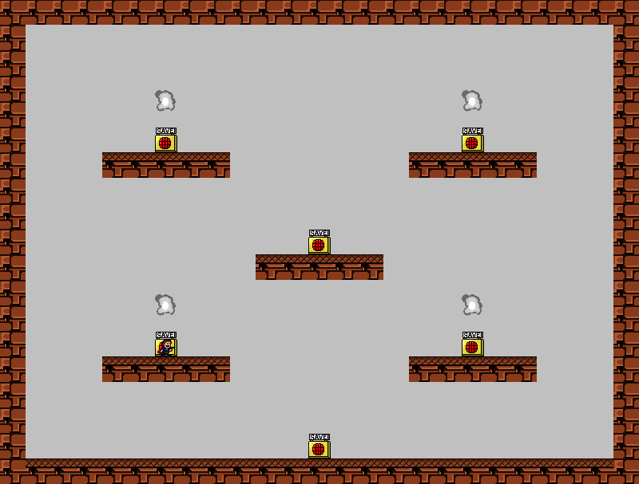
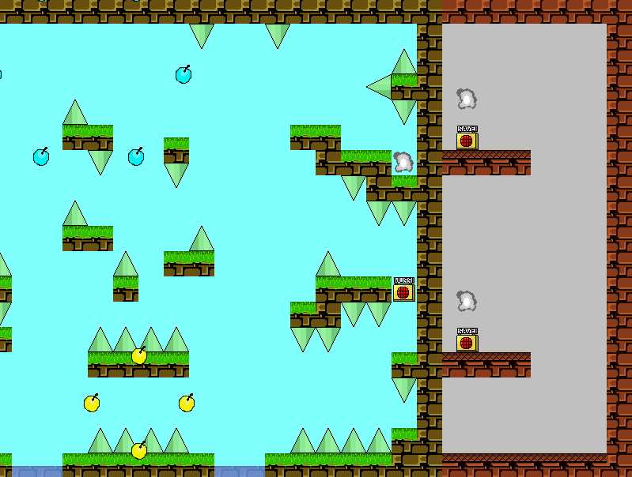
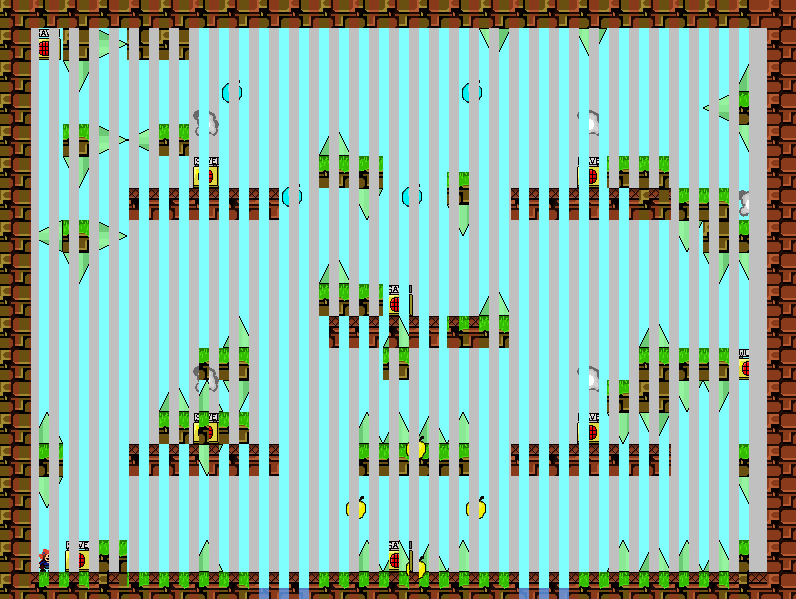
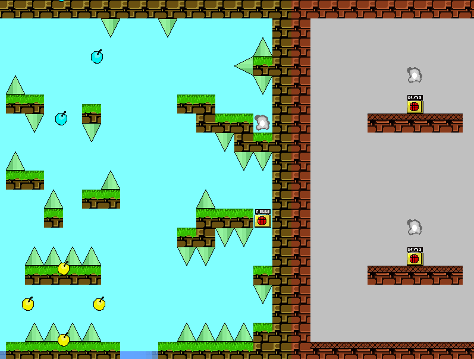
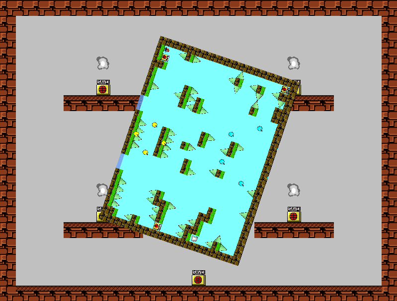
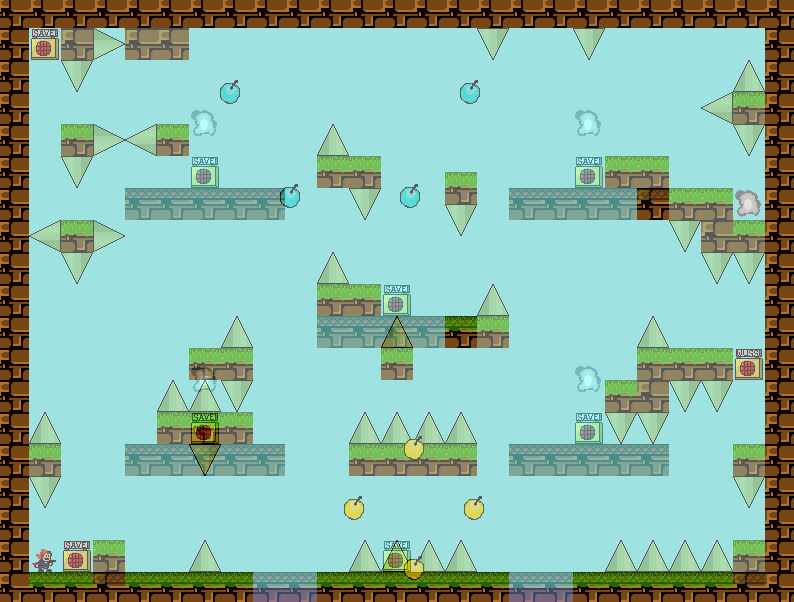

# 转场效果

以从房间传送到为例：

GM 内置的房间过渡效果：

* 0 = 无影响
* 1 = 从左创造：

* 2 = 从右创造
* 3 = 从上创造
* 4 = 从下创造
* 5 = 中心创造
* 6 = 从左移动：

* 7 = 从右移动
* 8 = 从上移动
* 9 = 从下移动
* 10 = 从左隔行：

* 11 = 从右隔行
* 12 = 从上隔行
* 13 = 从下隔行
* 14 = 从左推：

* 15 = 从右推
* 16 = 从上推
* 17 = 从下推
* 18 = 左转动

* 19 = 右转动
* 20 = 混合房间

* 21 = 淡入淡出

​
