# 新手教程

## xù

[~~作为一名 I wanna 玩家，相信很多人都有自己做一个 I wanna 的想法（当一次抖 S 的想法），但又不知从何入手。本帖将从最基本的方面说起，从零开始让你学会 I wanna 的制作方法。若有任何疑问请到提问帖提问，有价值的问题我会一并更新到这里。本帖禁止回复。~~](https://tieba.baidu.com/p/2885308275)

---

提问帖：http://tieba.baidu.com/p/2885307424
【目录】
2L → 常用资源下载
3L → 软件安装、引擎
4L → GM 界面操作、对引擎的基本说明
5L → Sprites(精灵)
6L →Backgrounds(背景)
7L → Objects(对象)
8L → Rooms(房间)
9L → 引擎中常用的 obj 解读
10L → Q 少浅谈 ld
11L → 陀螺带你坑人
12L 往下 → 常见问题解答

## GameMaker

GameMaker (以下简称 GM) 是如今大部分 I wanna 制作所使用的软件。[下载地址戳我](http://p9wc9w6dq.bkt.clouddn.com/Super_Gamemaker8_1.4.2_Install.exe)。

## 引擎

一些游戏制作者慷慨的放出了他们制作游戏所使用的“引擎”，也就是他们制作好的半成品 GM 工程文件，里面包含了大部分 I wanna 游戏所必须的资源（包括 kid、刺、苹果等图片素材以及游戏基本操作、基本系统的构建等）。这里使用果引擎（不然你来这干嘛？）

看到这里你应该下载并安装好了 GM，并且下载好了[果引擎](http://p9wc9w6dq.bkt.clouddn.com/iwbte-nikaple-edition-1.9.0.zip)并将引擎解压到一个文件夹中。准备好之后，便可以开始我们的 I wanna 制作了。

## 概览

使用 Gamemaker 打开 I Wanna be the Engine Nikaple Edition v2.x.x.gmk。在开始编辑之前，建议你先按 F6 运行一下游戏，然后狂按 shift，了解一下你接下来要做的游戏是什么样的。当你对示例游戏有一些了解后，按 Esc 结束游戏并回到 GM 界面。

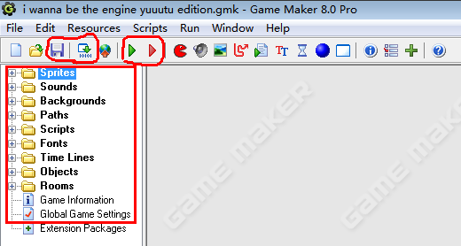

GM 界面中看着有很多的图标按钮，但实际上在制作大部分时间中我们所需要用到的只有左边几个文件夹与上面的 4 个按钮而已：

- 保存
- 生成游戏 exe 文件
- 运行游戏（F5）
- 调试游戏（F6）

左边文件夹的说明分别为：

- 精灵(sprites/**spr**)：游戏中使用的图片资源
- 音乐(sounds/**snd**)：游戏中使用的声音资源
- 背景(backgrounds/**bg**)：游戏的背景
- 路径(paths/**path**)：物体的运动路径
- 脚本(scripts/**script**)：游戏的脚本
- 字体(fonts/**font**)：游戏中将用到的字体
- 时间轴(timelines/**tl**)：对象按照一系列确切的时间点做出的运动（包括使用各类函数）
- 对象(objects/**obj**)：游戏的表演者，是游戏中重要的组成部分，没有它，游戏就没有了灵魂
- 房间(rooms/**room**)：对象表演的舞台
- 游戏信息（Game Information）：自定义游戏帮助
- 游戏全局设置（Global Game Settings）：一些设定如版本、窗口、快捷键之类

请仔细阅读上面的信息，因为下面为了方便讲使用简写来表示（`spr`/`obj` 等）

---

## 精灵

### 简介

在 GM 中，图片资源只有两种：

- 精灵(spr)；
- 背景(bg)。

spr 是 obj 所使用到的图片资源，并且可以轻松地做出动态效果。当你点开 Sprites 文件夹之后，可以看到引擎为你提供的很多图片文件，下面仅以这个 sprSpikeUp 为例来看看游戏中的动画效果是如何做出的。

1.  右键点击 sprSpikeUp（位于 Sprites→spikes->normal 文件夹下）
2.  点击 Duplicate，复制一份。
3.  双击打开复制得到的 spr；
4.  点击 EditSprite（编辑精灵），将 image 0 复制一份，得到 image 1
5.  选中 image 1，并执行 Images->Fade 命令(Ctrl+Shift+F)，并取消勾选“Apply to all images in the sprite”，单击 OK 之后，勾上左边的 ShowPreview，便可看到刺的动态变化了。

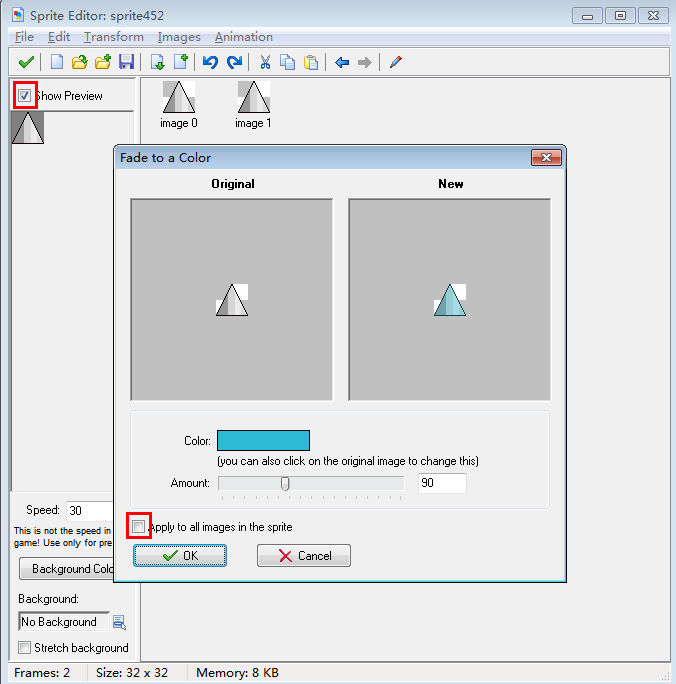

但是此时的动画闪烁的非常快，这是由底下的 Speed(30)决定的。这个数值决定着在 1 秒钟内图片播放的次数，数值越低，播放速度越慢。上述实例只是一个基本的动画方式，虽然有点瞎眼但至少让刺有了一些变化的效果。当然，利用 Animation 菜单中的各种命令可以方便地做出更好看的动画方式，比如：

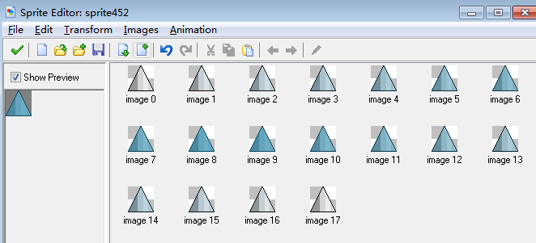

这样的渐变形式就比闪现好看多了，实现的步骤也不难：执行 Animation->Fade to Color，选定颜色之后，在对话框中填入 15，便会得到：

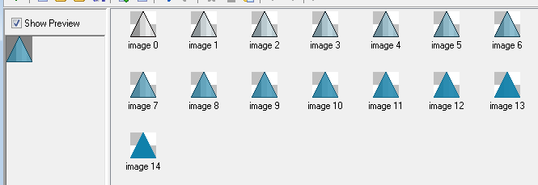
由于 image 9 之后的颜色太深，将它们删除掉，再执行 Animation → Add Reverse，便可得到平滑的渐变效果。Animation 菜单中有很多值得研究的地方，有着广泛的应用，具体内容还请各位自行探索。。。

### 从长带图创建

GM 的图像编辑器还有一项很方便的功能：从图片序列中创建精灵。比如这张扫雷的素材：

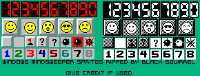

（顺带一说素材网站：http://www.spriters-resource.com，搜索需用英文）

假设我们需要一个从 0~9 的数字 spr。首先我们需要确定每个 spr 的大小（这里使用 PS）：

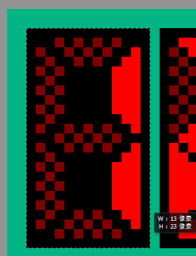

可以看出这些图片的属性：

- 宽 13 像素；
- 高 23 像素；
- 左空隙 2 像素；
- spr 之间空隙 1 像素。

在 GM 的图像编辑器中选择：`文件->从长带图创建...` ，并根据你所得到的长宽以及空隙大小调整参数，直至图像选框与你所需要的 spr 素材部分完全重合。

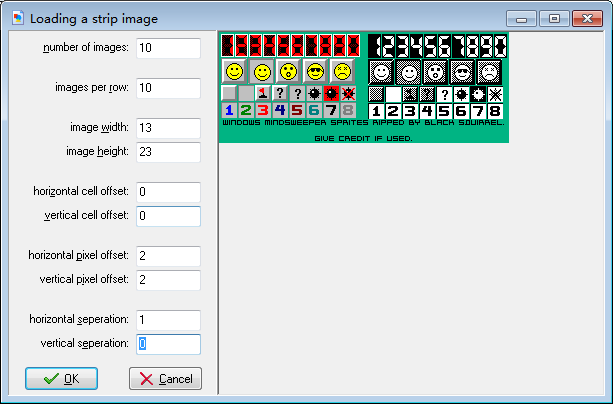

单击 OK，轻松得到素材：

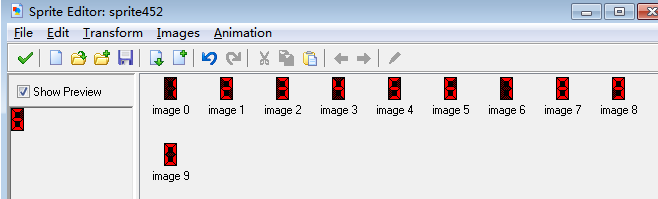

值得注意的是，预览中使用的 speed 数值并不是游戏运行时的 speed，关于此部分，参见 object 章节。

### 中心点与遮罩层

#### 中心点

打开光弹的 spr 素材，左边会出现 spr 的中心选项。虽然这个 spr 的大小为 64\*64，但是在游戏的过程中，使用这个 spr 的 obj 的坐标(x,y)却是唯一的。也就是说，游戏中这个 obj 的坐标就是 spr 中心点的坐标，并且 spr 在旋转或拉伸的时候也会参照这个中心点来进行旋转或拉伸。

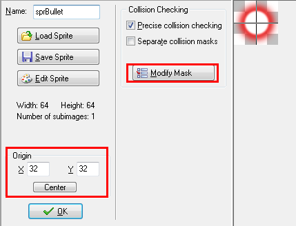

#### 笼罩层

笼罩层是 spr 用于碰撞/判定的的区域。单击编辑笼罩层：

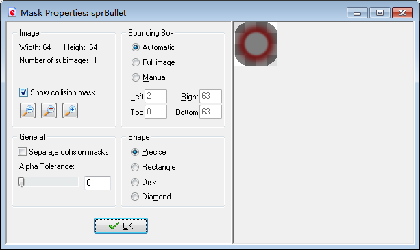

可以看到这个 spr 只要不是完全透明的区域都有碰撞判定，这显然不符合游戏的常理。我们需要的判定区域只有中间的较亮区域，这时候则可以调节左边的 Alpha Tolerance：

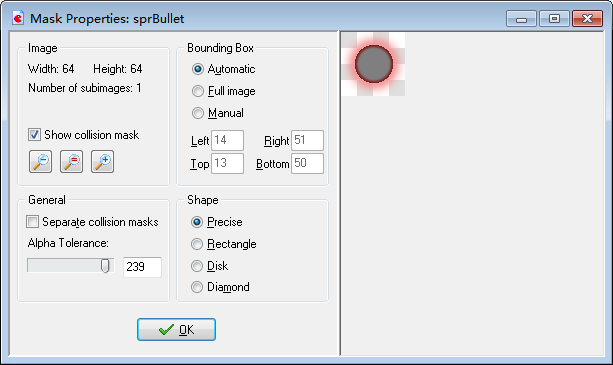

调节的时候可以观察右边的 Mask 预览，灰色的区域就是判定区域。调节到一个合适的值之后点击 OK，这时候会发现右边多出来一行小字：Modified，说明你已经成功的调整了 spr 的判定区域。

## 背景与贴图

### 背景

没什么好说的。。裁成你需要的大小就 OK

### 贴图

关于贴图素材的使用：


比如这张贴图素材，将它拖入到 GM 里面，选择 `背景`：

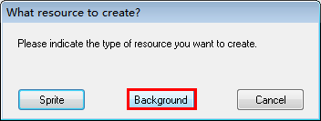

之后勾选 `作为贴图使用`，设置 `贴图宽` 与 `贴图高` 为需要的数值，就可以在房间中使用这些贴图素材了。


### 对象

对象是游戏最重要的组成部分，它们使用精灵作为图片素材，它们的行为方式由你所写的代码决定。

### 对象的属性

以 player（也就是 kid）为例（在 Objects->system->player->player，或者 Ctrl+F 输入 player 找到）：

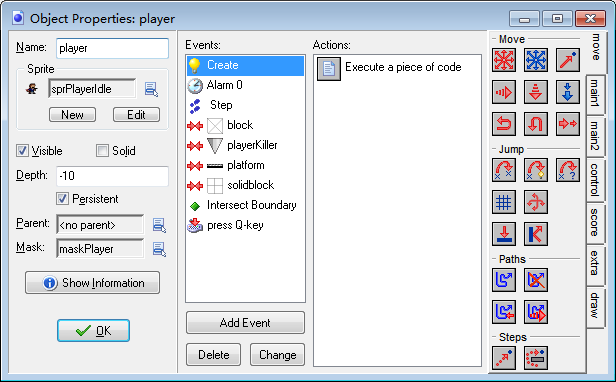

在左侧有 player 这个 obj 的一系列参数：

- Sprite：obj 所使用的精灵（也就是长啥样）
- Visible/Solid：决定这个 obj 是否可见/是否为固体
- Depth：深度值，深度只越高，则离得越远（背景为高深度，前景为低深度）
- Persistent：基本上用不着勾这个（player 这个是个例外）
- Parent：该 obj 的父对象，子对象继承父对象的事件（刺的父对象是 playerKiller，而 player 碰到 playerKiller 的时候会触发 player 死亡的事件，所以在刺中就算没有代码，在 player 碰到刺的时候，player 也会死亡）。值得注意的是，子对象中如果有与父对象相同的事件，则会优先执行子对象的事件而覆盖掉父对象的事件。
- Mask：用于决定该 obj 的碰撞盒（collision box），用的不多。

### 基本事件与动作

事件：

- Create Event：在该 obj 被创建时所执行的事件，用于初始化变量等，仅执行一次。
- Step Event：I wanna 游戏的正常 fps 一般都为 50，GM 有一个内置变量 room_speed 用于决定游戏运行的速率。也就是说 1 秒的时间被分为了 50 步，而在这每一步中，都会执行 Step Event 中的事件。如果有需要重复不断执行的动作，则需要放在 step 事件中（普通的 Step 即可，Begin Step/End Step 基本用不到）。
- Alarm Event：计时器事件，可以方便地在一段时间后调用。例如在 player 的 create 事件中这样有一行代码” alarm[0] = room_speed;”，表明在 player 被创建之后过 1 秒执行 Alarm 0 事件，而 Alarm 0 事件会将游戏时间加 1，并且继续执行 alarm[0]=room_speed。这样一来 Alarm 0 事件每秒被不断调用一次，时间变量每秒被增加 1，也就达到了计时的效果。
- Collision Event: 碰撞事件。用于该 obj 与其他 obj 碰撞时，player 和砖块(block)，刺，板(platform)碰撞时都会有各自的事件发生。了解了 create/step/alarm/collision 事件之后便可进行基本的 obj 的动作编辑了。

动作：动作分为两大种：拖放动作与代码。拖放动作比较直观好理解，代码动作为 Controls 选项卡下的”Execute Code”动作进入代码编辑器。

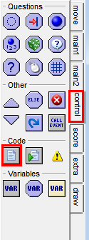

下面以拖放动作讲解事件、动作的关系，代码只作为附带参考。

#### GM 运行的一些基本参数

时间的基本单位为帧，在 I wanna 游戏中 1 帧 = 0.02 秒；长度的基本单位为像素（普通砖块的大小为 32\*32 像素）；坐标系统：房间的左上坐标为(0,0)，向右向下为正方向。方向系统：向右的方向为 0，逆时针方向为正向，也就是：向上的方向为 90，向下的方向为 270……

#### 你的第一个 obj

在这部分中，我们会制作一个不断朝 player 发射刺的 obj（发射器）。

1.  先新建一个 obj，取名为 `objSpike` ，用作飞向 player 的刺，并为这个 obj 选择我们刚刚做好的蓝色渐变的精灵，注意精灵原点要选择图像的中心：

    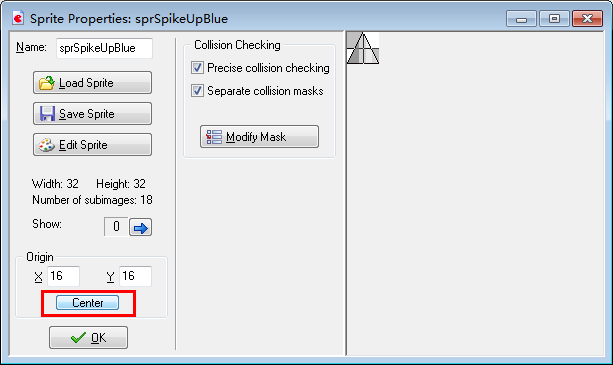

    父对象选择 playerKiller（位于 parent 文件夹）。

2.  新增一个 Create 事件，从右边的 move 选项卡拖一个”MoveTowards”的动作，这样在这个 obj 创建的同时，我们就可以让它飞向 player。在这里：

    - ”.”代表”的”，player.x 也就是 player 的 x 坐标；
    - Speed 表示飞行的速度（每步 5 个像素，这样 1 秒钟之内这个刺就会飞 250 像素，属于中速）。

    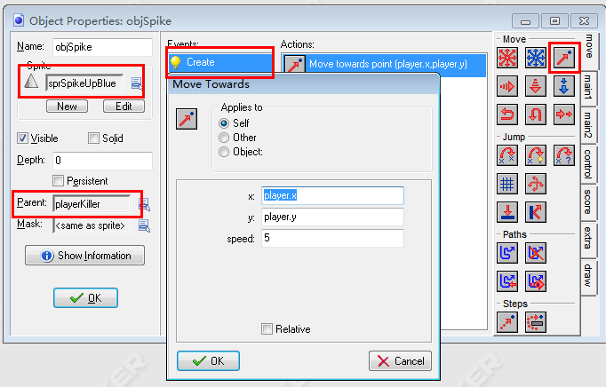

    调节这个 spr 图像播放的速度：在右边的 main1 选项卡中找到 Change Sprite 的动作，选择我们刚刚做好的蓝色刺的精灵，subimage 取默认值-1，播放速度为我们刚刚预览的速度 15 再除以游戏运行的速度 room_speed（当然你也可以直接算出来 15/50=0.3）。这样我们便完成了这个刺的基本参数设定。

    

    代码实现方式 1：（代码事件位于 control 选项卡第六行左边第一个）

    ```gml
    move_towards_point(player.x, player.y, 5)
    image_speed = 0.3
    ```

    （使用移动到某点的命令）

    代码实现方式 2：

    ```gml
    speed = 5
    direction = point_direction(x, y, player.x, player.y)
    image_speed = 15 / room_speed
    ```

    （direction 为当前 obj 的运动方向，使用 point_direction(x1,y1,x2,y2)可以得到(x1,y1)与(x2,y2)两点间的方向）

    这样我们便完成了这个 obj 的基本动作，在创建的同时就会飞向 player，但这样会有一个问题：无论这个刺是以什么方向飞向 player，它的朝向总是朝上，而没有尖刺朝着 player 飞的那种感觉。所以我们再添加一个 step 事件，在 main1 选项卡中添加一个”Transform Sprite”事件，在这个事件中我们旋转这个 obj 的精灵，使它的图像旋转角度总为它飞行的方向减去 90 度，使得刺尖总是朝向 player。（可以这么考虑：当刺往上飞的时候方向为 90，图像旋转角度为 0，所以我们需要保持图像旋转角度比方向小 90）

    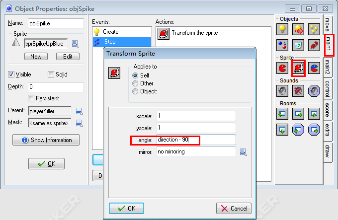

    代码实现方式：

    ```gml
    image_angle = direction - 90
    ```

    (image_angle 即为该 obj 的精灵旋转角度，direction 为方向)
    这样这个飞向 player 的刺就基本完成了，下楼中我们将创建一个 obj 用来发射这个刺。

3.  下面我们创建一个 obj 用来发射我们刚刚制作好的飞向玩家的刺：新建一个 obj，叫做 objSpikeShooter，在 spr 的文件夹中复制一个普通的向右的刺的 spr，并将图像原点选在中心的位置，为这个 obj 选定这个简单加工后的 spr：

    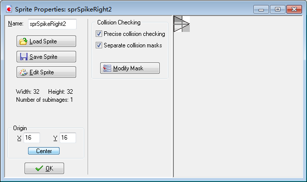

    （刺尖朝右的话，图像旋转角度与方向一致，就不用像刚才一样减去 90 度了，可以简化一些），增加一个 create 事件，并增加右边 main2 选项卡的 Set Alarm 动作，将 Alarm 0 设为 1，这样在这个 obj 被创建的 0.02 秒之后就会执行 Alarm 0 事件，这个时间一般可以被我们忽略掉，相当于创建的同时立即执行 Alarm 0 事件。

    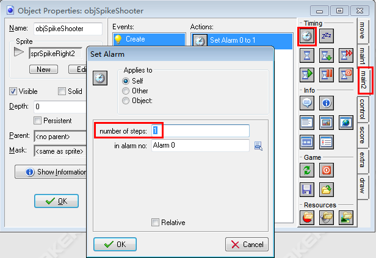

    代码实现方式：

    ```gml
    alarm[0] = 1
    ```

    新增一个 Alarm 0 事件，在右边的 main1 选项卡中拖一个 CreateInstance 的动作，选择刚刚创建的 objSpike，并且勾上 Relative（勾了 relative 之后就会在相对于这个 objSpikeShooter 的(0,0)位置，也就是与其本身重合的位置创建 objSpike，不勾的话会在相对于房间(0,0)的位置也就是房间左上角创建这个 objSpike）。

    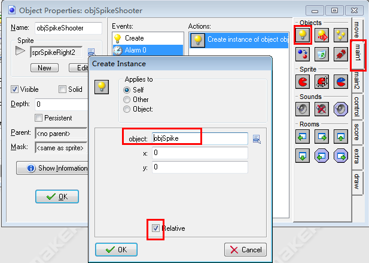

    别忘了再设置一下 Alarm0，达到每秒创建一个向 player 飞的刺的效果。

    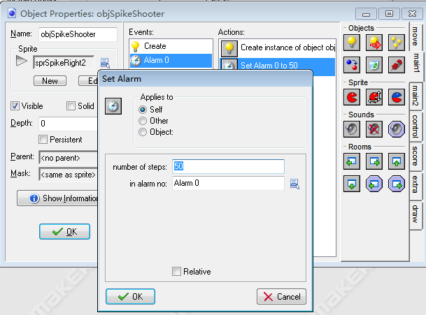

    代码实现方式：

    ```gml
    instance_create(x, y, objSpike)
    alarm[0] = 50
    ```

    (instance_create(xx,yy,obj)在坐标(xx,yy)创建一个 obj，这里的 x,y 为 objSpikeShooter 的 x,y 坐标，这样我们就在与 objSpikeShooter 相同的地方创建了一个 objSpike)
    同时我们想让这个刺的尖端朝向 player，那么添加一个 step 事件，让 spr 的旋转角度总是与这个 obj 到 player 的方向相同。也就是说，如果 player 在这个刺的正上方，那么 point_direction(x,y,player.x,player.y)为 90 度，相应的这个刺的 spr 也会旋转 90 度来朝向 player。

    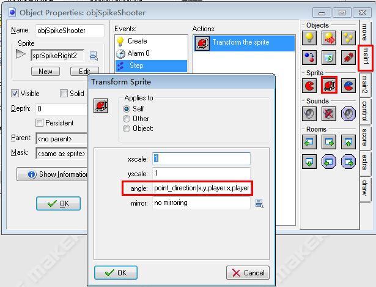

    代码实现方式：

    ```gml
    image_angle = point_direction(x, y, player.x, player.y)
    ```

    这样我们便完成了这个简易 obj 的制作，希望大家能对事件/动作有一些基本的了解。下一步就是放到房间里面去测试了！（参见下一楼）

## 房间

打开 Rooms 文件夹，会发现 3 个子文件夹：init, example, online。init 为游戏初始化必须的房间，且必须位于所有房间的最上端！

!> 不要改变 init 文件夹中的房间顺序！特别是 **rInit 一定要排在第一个！rInit 一定要排在第一个！rInit 一定要排在第一个！**

example 文件夹中均为引擎作者提供的实例关卡。下面我们在 free 文件夹中新建一个房间，来看看房间中的各个参数：

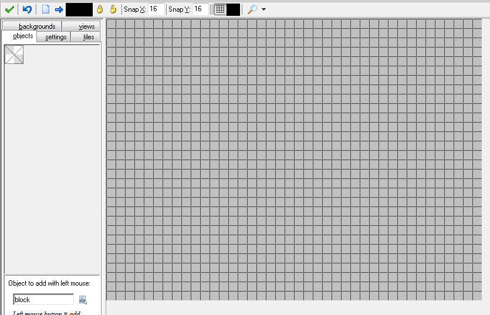

涂黑的表示在你制作 I wanna 游戏的过程中，基本不会用到的一些功能…

上方工具栏从左到右的功能分别是：

- 确定（完成房间编辑）
- 撤销（只能撤销一步）
- 清空所有元素
- 移动房间的全部元素
- 锁定全部元素
- 解锁全部元素
- 网格大小（放置 obj 的时候都会对齐到网格，一般网格大小选择 32\*32）
- 显示网格
- 查看房间中的部分元素。

左边的设置栏包括：

- backgrounds（背景）
- views（视野）
- objects（对象）
- settings（设置）
- tiles（贴图）

## 房间 - 设置 settings

I wanna 游戏标准的房间大小应为 800 _ 608，如果要做大房间也可以使用更大的数值（比如 1600 _ 608 或者 800 \* 1824 等等），Speed 设置为 50 。

## 房间 - 背景 backgrounds

- Draw background color：如果你使用的是背景图片作为房间背景，可以取消勾选 Draw background color 以节约资源
- Visible when room starts：勾选，表示进入房间时就会加载背景。
- Foreground image：勾选的话则会将当前图片作为前景（一般用不上）
- < no background >：这里可以选择你想要的房间背景
- Tile Hor./ Tile Vert.：水平方向/竖直方向的偏移量（像素）
- Stretch：勾选的话则会将图片拉伸覆盖整个房间。
- Hor. Speed/Vert. Speed：背景图片的运动速度，适当的运动达到更好的背景效果。如果你的背景图片可以循环播放（也就是左边的图能与右边的图接起来并且没有违和感），可以适当加点背景运动速度。以这张背景为例我们设置好之后当前房间应该是这样：

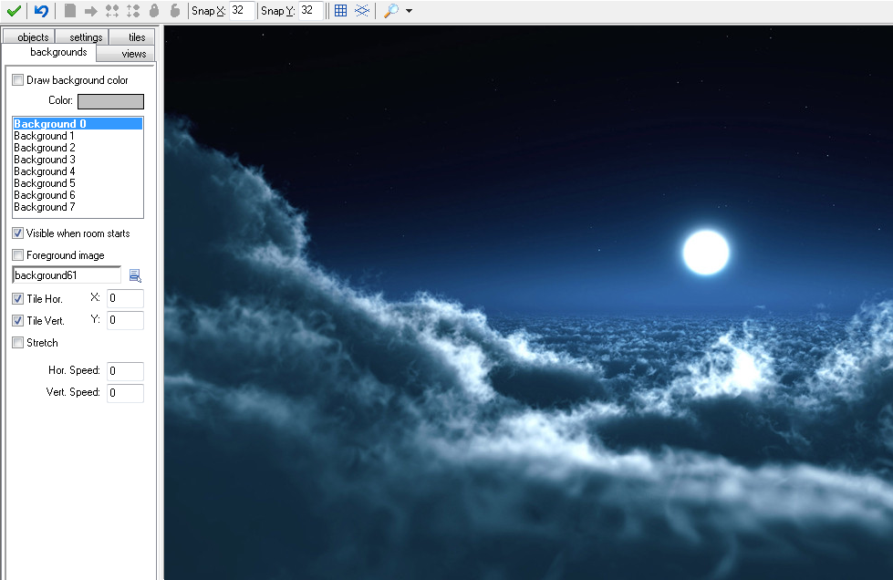

## 房间 - 视图 Views

一般来说按图中设置即可

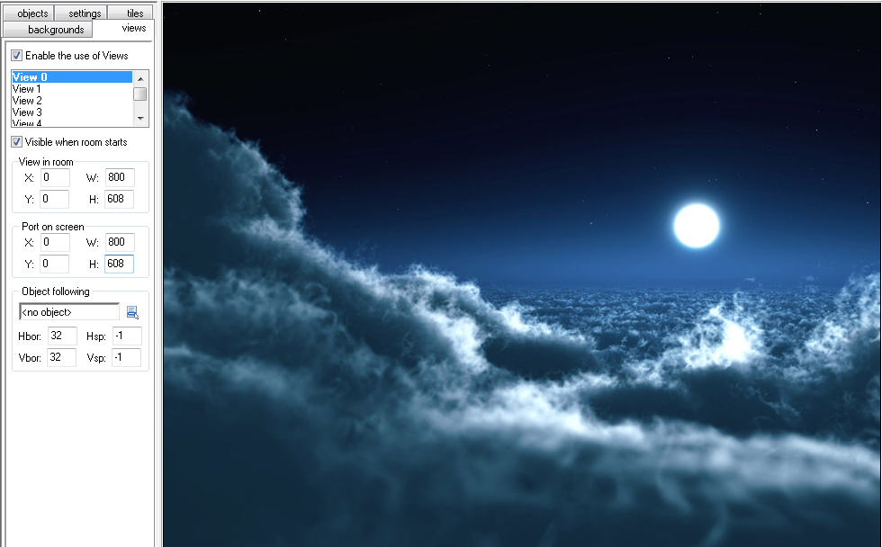

如果在大房间中想跟随 player 的视角的话，Object following 如图设置：

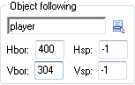

## 房间 - 对象 Objects

现在终于到了关卡设计的时候了，单击房间左侧的 Objects(对象)选项卡，再单击对象面板的任意空白位置，即可打开 obj 选单。一个典型的 I wanna 房间应该必须有以下几个 obj：

- player_etc-> playerStart：决定 kid 在该房间中的出生位置；
- player_etc-> playMusic：用于播放 bgm，用法在楼下会讲到；
- player_etc-> camera：如果你的房间大小大于 800*608（例如 1600*608），那么这个 obj 会帮助你把房间的视图分为两部分，当 player 从左边一半走到右边一半时，视野会跟着自动切换。（如果房间大小只有 800\*608 的话不放这个 obj 也没有关系）
  block：地板，player 能够走动的地方。
- warp：传送到其他的房间，用法见下。其他：你所用到的其他 obj，比如刺和苹果什么的~
  值得注意的是，左边工具栏下方有一个删除底层的选项，如果需要将两个 obj 叠在一起，最好取消勾选这个。

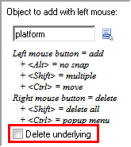

同时这里有几个功能键的运用（对贴图也适用）：

- 鼠标左键 → 添加当前 obj
- Alt+鼠标左键 → 忽略网格添加 obj
- Shift+鼠标左键 → 一次添加多个当前 obj
- Ctrl+鼠标左键 → 移动 obj
- Ctrl + Alt + 鼠标左键 -> 无视网格移动 obj
- 鼠标右键 → 删除鼠标指针下的 obj
- Shift+鼠标右键 → 删除鼠标指针下的所有 obj
- Ctrl+鼠标右键 → 打开菜单（有两个命令比较常用：Change Position（改变 obj 位置）与 Creatioin Code（下面会提到））摆好对象后，一个简单房间的雏形就有了：

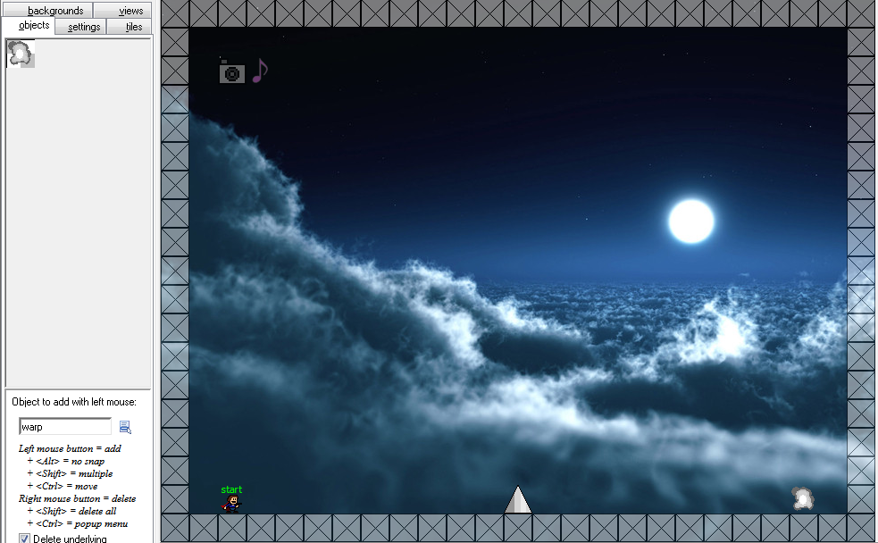

## 房间 - 贴图 Tiles

由于砖块在游戏中是不可见的，我们需要为它们穿上衣服。注意贴图的方式，贴图的好坏往往决定了别人看到你游戏时候的第一印象。一个连贴图都做不好的游戏会给人一种不想玩的冲动。

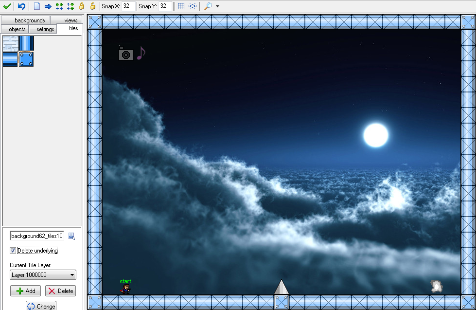

贴图有个很重要的属性：深度。

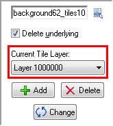

深度值越大的贴图层，会出现在画面的更后方。所以如果我们想往砖里面摆刺的话，最好找到刺的 obj，将深度值调到>1000000 的数值：

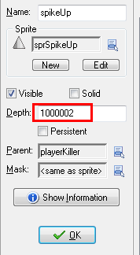

顺便摆上刚刚做好的 obj：

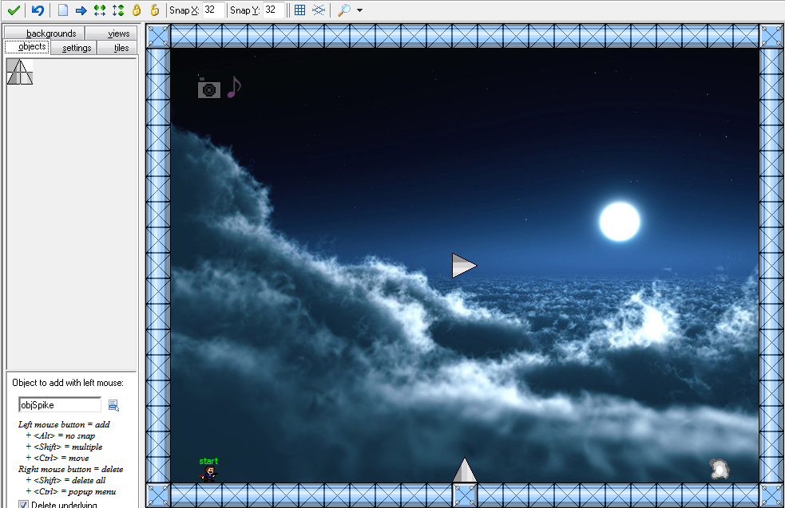

就可以开始测试了！（测试之前先按照楼下设置 warpStart）

---

先解决楼上的两个 obj 的用法：warp 与 playMusic。

它们都使用到了一个非常重要的功能：Creation Code。用法如下：放进房间之后按住 Ctrl 右键单击 warp，选择 CreationCode…：

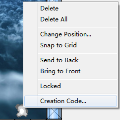

在里面决定写 roomTo=(想传送到的房间)。如果想传送到房间的某个位置，可以写”warpX=传送到 X 坐标; warpY=传送到 Y 坐标”，如果不写的话，则会从下个房间的 playerStart 所在地开始。比如：

```gml
roomTo = rTraps
warpX = 128
warpY = 256
```

这样我们便会传送到房间 rMegaman01 的(128,256)位置。

playMusic 的代码简单点，在 Creation Code 里面写：
sound_stop_all();
sound_loop(你想要的播放的 bgm)
即可。例如：

```gml
sound_stop_all()
sound_loop(bgmSky)
```

其他引擎中自带的 obj 可参考 [Object 文档](objectref.md)

free trigger：触发用的坑爹刺。freetrigger 为 player 触发机关的区域，xxxx_free 为触发后会坑爹的刺。具体用法为：在 freetrigger 的 CreationCode 中写：
trg = xx; (xx 为数字，各个触发用的 xx 数值应不相同)
在 rise_free 的 CreationCode 中写：
trg = xx;(与对应的触发用 freetrigger 的 xx 数值相同)
v = vv; (vv 为触发后的纵向速度，向下为正)
h = hh; (hh 为触发后的横向速度，向右为正)
这样就完成了基本的触发开关设计。例如：

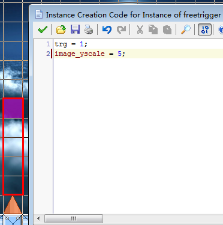

这里使用了 image_yscale 来拉伸触发区域（以左上角为基准点），y 方向的长度拉伸 5 倍，达到区域填充的效果，也简化了代码量。（或者放 5 个 freetrigger，每个里面都写 trg=1）
rise_free 中的代码：

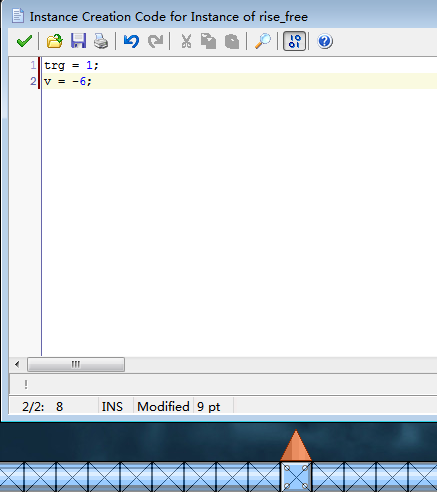

（没人看的原理：当 player 碰撞了 freetrigger 的时候，会将 freetrigger 这个 obj 的 triggered 变量设置为 trg。

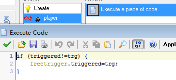

而在触发刺的 step 事件中，会不断检测 freetrigger 的 triggered 这个变量

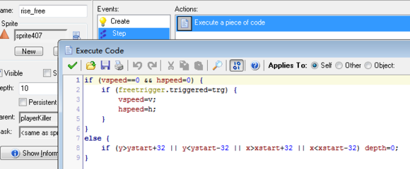

由此可见，如果 player 碰撞了对应 trg 数值的触发开关，则会触发同样 trg 数值的触发刺，而刺的速度由 v 和 h 这两个变量决定。）

bossitem/bossblock：拿到对应的 bossitem 后，bossblock 就会消失，用于 boss 房间。

secretitem/itemview：拿到对应的 secretitem 后，itemview 就会显示拿到的 secretitem

timelimit：限时用，用的不多，自行发挥。

bosses：最基本的 boss 范例。有需要的可以自己看看。
BOSS 教程：http://tieba.baidu.com/p/2885387840

parent（父对）：
platform：所有板子的父对，默认是不可见的，如果你想做一个能踩的云，最好这么做：先放一个云的贴图，然后放几个 platform。

playerKiller：所有能够杀死 player 的 obj 的父对，碰到 player 就会把 player 给 boom 了，如果你自己做了一些可以杀死玩家的 obj，可以将父对选为这个。
roomChanger：切换房间 obj 使用的父对（warp 等 obj 的父对）

其他：
obj_ue：重力反转，个人不太喜欢反转后的操作，如果没有 iwbt_takatata 那样的关卡设计能力的话，慎用。
obj_sita：重力正常化。
movingPlatform：能够左右移动并且带着 player 一起移动的板。使用方法为在 Creation Code 中写 hspeed = 你想要的横向速度 ; vspeed = 你想要的纵向速度。
objkumo/objblockkumo：云。。。objblockkumo 的碰撞感很差，推荐使用 platform+objkumo。

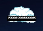

warp：参见上文
warpStart：决定游戏开始时的初始房间，在碰撞 player 的事件中把 roomTo = 后面改为你想要进入的初始房间名称即可。

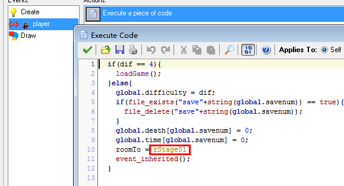

objcursor：鼠标的 obj，可以自定义鼠标样式，用的不多。

---

关于关卡设计 LevelDesign (ld):
浅谈一下制作 i wanna 游戏时所遇到的关卡设计问题。对于初学制作 i wanna 的同学来说，相信大家都迫不及待的想完成一个属于自己的 i wanna 游戏并让自己的朋友来玩。然而这里首先需要声明的是，无论你做了什么样的关卡，请务必自行测试一下整个游戏的全流程，切忌没有测试就直接发布出来玩。制作游戏，遇到 bug 总是在所难免，请自行排除较多 bug 之后，确保在一般正常情况下可正常运行游戏之后，再将游戏发布出来，不然害人害己。
I wanna 游戏制作主要包括跳刺、坑、综合和 boss，如果你是一名初学 iwanna 制作的同学，你可能不知道怎么做比较复杂的坑，做比较漂亮的关卡和 boss，你可能因为能力有限只能做一些简单的坑或者就是纯跳刺(没坑)，那么这里有一些做图建议。由于游戏没坑，所以做跳刺图，应尽可能的在地形和刺阵上面下功夫，一个复杂的地形能够让玩家眼花缭乱，从而对整个游戏的构造产生好奇，产生兴趣，并且好的地形也容易产生好的刺阵。这就需要玩家在一个有限的 room 里面去思考 kid 的路线，做到一会儿上，一会儿下，绕来绕去，给人感觉特别充实。如下图所示：

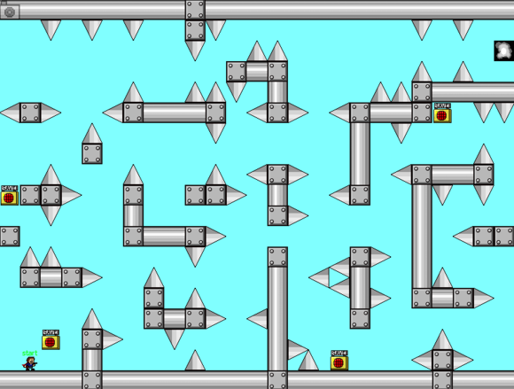

在地形设计理想的基础上，可以针对刺阵下点功夫，这里需要注意的是，如果仅仅用 32\*32 的网格是难以摆出理想的刺阵的。要想摆出好的刺阵，就必须使用 16\*16 甚至 8\*8 的网格来进行编辑，下图是 uhuhuspike3 的例子，是一个不错的地形+刺阵的例子：

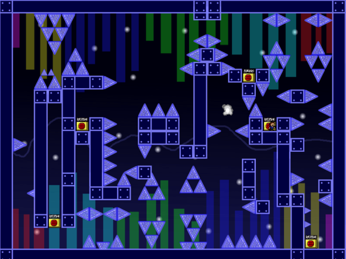

那么什么样的地形不推荐呢，就是那种直来直去的地形，玩家基本就一路走，刺阵也很普通，这种跳刺游戏就没有什么新意，很难让人玩的开心：

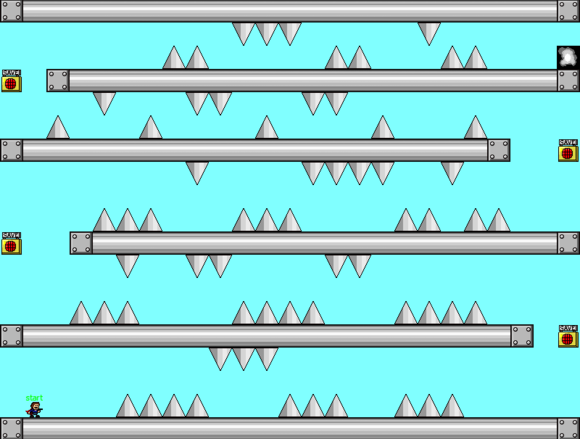

需要注意的是，跳刺游戏，美观程度非常重要，在游戏性上难以与孔明向、综合向游戏媲美时，如何让你的画面更美观，便显得格外重要。下图是两个例子：

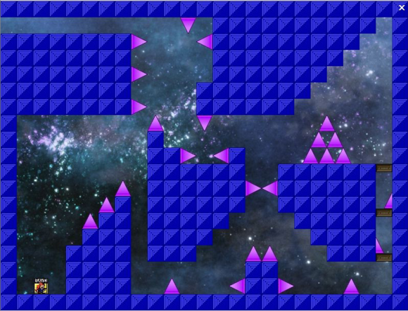

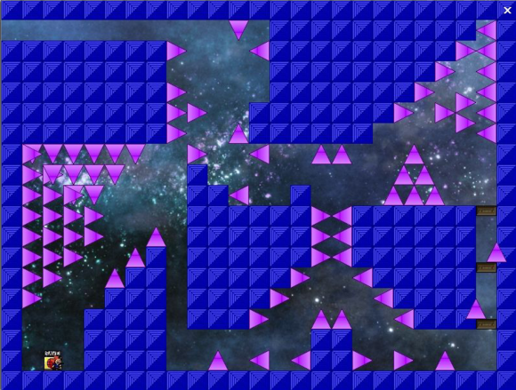

尽量不要摆太多多余的刺上去，影响美观效果。某些隐藏在墙壁里的刺，不要显示出来，应该把深度设的较大。

---

关于 IW 游戏中的坑：坑乃是 I wanna 系列游戏一大特色，如果你想制作一个综合向或孔明向的坑爹 I wanna，适当地加上坑爹能令游戏更加有趣，一般的坑大多使用 freetrigger、Block 隐藏砖组合，亦可使用个人素材，path 等。

制作概述一般的简易的坑可使用 freetrigger 简单制成，制作方法如上述。虽然 freetrigger 主要用作比较简易的坑，但只要掌握了刺阵组合仍何使其变得有趣。Block 隐藏砖即 BlockNotVis、BlockVis，以假砖或看不到的砖引导玩家中伏，这种坑一般比较无脑，不建议一个游戏中使用太多，利用地形因素可令隐藏砖看起来不太违和，融入背景之中。path 坑的运行可利用下面会提到的 path_free 刺，path_free 与其他刺的 trg 大同小异，利用 path_free 刺可制作出按路径进行的刺，较只向上下左右飞的刺更为灵活。 \*建议一个 save 之间的坑不要太多，太多坑会令玩家感到烦躁。

心理因素因为初见时玩家不确定一个刺/任何地方是否有坑的因素，会试探疑似坑的地方，只要捕捉到玩家这个心态，就可以令到玩家中伏。要让玩家更容易被坑，可再加以引导。如图三，前两个的刺皆往上飞，玩家受到暗示认为第三个刺也往上飞，勾引结果中坑。（但这个方法对高玩没什么用了，对高玩玩家要更加不明显的引导才坑到他们）其他心理坑大同小异，建基于这个因素之上，在基础上加以变化即可。

图一 最基本的 freetrigger 坑，粉色为 freetrigger

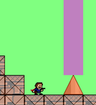

图二 地形坑 + 隐藏砖坑 示例，上方为 BlockVis，下方为小刺，当 player 磕头二段跳过时会撞上 BlockVis 上面。

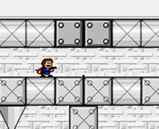

图三 简易心理坑示例，粉色为 freetrigger,前两个的刺皆往上飞，最后一个 freetrigger 如玩家勾引下方的刺会往上飞。

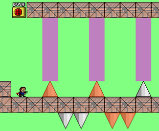

除此之外，推荐玩玩一些坑爹 Iwanna，玩过了以后较容易掌握到坑的做法，看着游戏的坑爹是很坑，其实制作的方法很简单，略懂 gm 也就可以弄出来了。推荐坑作 I wanna be the party
I wanna conquer ManyTraps
初见杀し避けたい制作坑不能急于求成，坑的 idea 不是想有就有，没创意时最好去 Zzz，Zzz 完可能就有了。

---

常见问题：
Q：为什么播放音效的时候 BGM 也停止了？
A：音效请转换为 wav 格式使用，在 GM 中 mp3 格式的音乐不能同时播放多个。

Q：为什么我写了 Creation Code 碰 warp 还是会报错？
A: 请注意 GM 能够识别大小写

Q：如何解决 WIN8 对游戏的不兼容问题？
A：WIN8 不兼容问题是由于游戏音效的重复播放引起的。解决办法为将所有的 sound_play(snd)之前都添加一句 sound_stop(snd)。为了更方便的解决这个问题可以使用在 boss 教程中提到的 sound_fix 脚本。

Q：如何解决按 R 之后游戏画面回到显示屏中心的问题？
A：将 rInit，rTitle，rMenu，rSelectStage 的大小全部调整为 800\*608 即可，保持房间的视野总为 800\*608，视野就不会归中。

---

Q：如何让触发的刺停止下来？
A：既然要使刺停下来，我们可以采用让刺不采用横向/纵向速度的触发方式，而改用路径的触发方式。我们仍然采用 freetrigger 来触发（注意观察这种触发方式，加以变通之后，几乎所有的触发机关都能用 freetrigger 完成）：首先复制一个 rise_free，将 step 事件的代码改为：

```gml
pathspike
```

其中 pth 表示当前 obj 正在沿着哪条路径运动，path_scale 表示当前路径的缩放比例。当 player 触发了对应的 freetrigger 之后，freetrigger.triggered=trg 便会成立，而默认状态下 flag 变量的值为 0，在触发之后将它设为 1，便可达到只触发一次的效果；函数 path_start(pth,spd,enda,abso)可以让 obj 沿着某条路径运动，其中 pth 为想要运动的路径，spd 为运动速度，enda 为运动结束后的动作（如果仅仅是让触发刺停止的话，enda=0 即可，更多信息请参考帮助文档），abso 一般为 0 即可。一般来说我们可以先准备好 4 种 path：向上/下/左/右各移动一格的 path，这里以向上移动一格（32 像素）的 path 为例：

最好取一个好记的名字：比如 p(ath)U(p)1(格)，代表向上移动一格的路径。同时要取消 Closed 的勾选，否则这个路径就是从(0,32)到(0,0)再到(0,32)的来回运动。最后看看 path_scale，由于 GM 将未初始化的变量视作 0，所以在不填 scl 的时候，我们路径不被缩放，否则将路径放大/缩小 scl 倍，这样一些沿简单路径（只朝一个方向）移动的刺就解决了。如何使用：
freetrigger 中写 trg=xx；
path_free 中：

```gml
trg = 1
pth = pU1
spd = 4
```

这样一旦触发了这个刺之后，刺便会以 4 的速度向上移动一格然后停止。如果想移动两格，则再添加一句" scl = 2; " 即可。值得一提的是在 CreationCode 中可以输入下面的代码来改变刺的 spr：

```gml
spr = sprSpikeUp
trg = 1
pth = pU1
spd = 4
```

这样一来就算这个 obj 的 spr 是一个紫色的刺，在游戏中也会显示为普通刺，并且在编辑的时候也方便我们注意到这个刺是能够被触发的。

Q：player 走出房间之外就会死，如何挡住使 player 走不出去？
A: scrSealRoom(). 当你对 GM 有一定了解之后，可以看看这篇小路总结的一些 I wanna 编写时的小技巧：
http://tieba.baidu.com/p/2353910268
